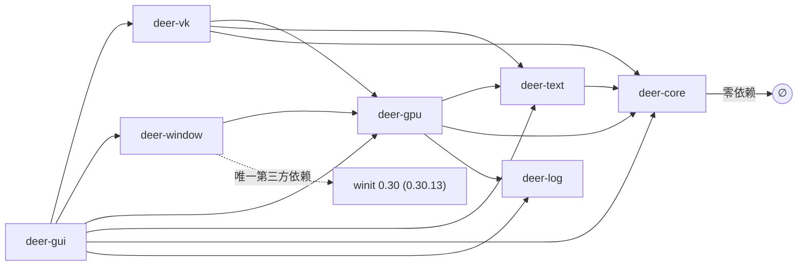

# deer-gui 系统架构与设计文档

> **生成方式与验证状态**：本文基于工作树 HEAD `36e7b93`（2026-09-29）的**静态源码审阅**产出；
> 所有结论均标注了出处文件路径。仓库纪律要求「数字以运行输出为准」，本文不固化任何测试条数。
> 文中的功能状态以 [`FEATURES.md`](../FEATURES.md)（唯一真相）为准，两者如有出入以 `FEATURES.md` 为准。

---

## 1. 项目定位与技术栈

**deer-gui** 是一个从零实现的 Rust GUI 运行时：**无 web、无 DOM、无 `wgpu`/`ash`/`vulkano`**。
核心理念是以**节点树（node tree）**为中心：两条作者路径（命令式 `Builder` 与 `.dui` 场景文件）
产出**同一棵树**，布局引擎（自研）算出几何表，再交给**可插拔的渲染后端**（CPU 软件光栅化参考后端 +
自研 Vulkan 绑定后端）。

| 项 | 内容 | 出处 |
|---|---|---|
| 语言 / 版本 | Rust ≥ 1.85，edition **2024** | `Cargo.toml`（`[workspace.package]`） |
| 工程形态 | Cargo workspace，5 个 crate | `Cargo.toml`（`members`） |
| 第三方依赖 | **仅 1 个**：窗口层 `winit 0.30`（Q-1 已登记例外）；其余 crate 零第三方依赖 | `crates/deer-window/Cargo.toml`、`ROADMAP.md`「依赖例外登记」 |
| 图形 API | Vulkan（符号自声明 + `LoadLibraryW` 运行时加载，**无需安装 Vulkan SDK**） | `crates/deer-vk/src/ffi.rs`、`crates/deer-vk/src/loader.rs` |
| 着色器 | **自研 SPIR-V 汇编器**（`spirv.rs`，预编译字节数组内嵌，无 `glslc`） | `crates/deer-vk/src/spirv.rs` |
| 发布状态 | 版本 `0.0.0`，未发布 crates.io，按 path 依赖使用 | `README.md`「Installation」 |

---

## 2. 整体架构

### 2.1 分层总览

自上而下是**视觉顺序**（应用 → 门面 → Server → 纯核心）；图中的 ①–⑤ 只是**图内编号**，
**L0–L3 的归属判据一律看 §2.3**。箭头方向 = 依赖方向（下层不知道上层的存在）。
**物理拆分（LY1–LY3）已完成**：crate 边界现在与 §2.3 的归属一致。

```mermaid
flowchart TB
    subgraph L5["⑤ 应用层（用户代码）"]
        EX["examples/ 21 个可运行示例<br/>window_preview · counter · interactive_form ·<br/>window_parity · render_to_png · testkit_demo …"]
        DOWN["下游项目（test_project/deer-hello）"]
    end

    subgraph L4["④ deer-gui —— 门面 + 交互逻辑（纯逻辑）"]
        FACE["lib.rs<br/>render_tree_to_png / rgba(_with_font)<br/>prelude 一条 use 拿全能力"]
        INTERACT["interaction.rs<br/>UiState · hit · handle · ClipSnapshot"]
        SCRIPT["input_script.rs<br/>DEER_INPUT_SCRIPT 脚本解析与重放"]
        TESTKIT["testing.rs（feature=testing）<br/>testkit：Harness / GpuProbe / Repro"]
        ENVGATE["env_gate.rs<br/>门槛变量判定（先 trim 再比）"]
    end

    subgraph L3["③ deer-gpu —— RenderServer·CPU + HAL 契约（L1；HAL 暂驻本 crate）"]
        HAL["Backend / Device / Swapchain / Frame<br/>Renderer trait · RawWindowHandle"]
        RENDER["render.rs：DefaultRenderer<br/>树+几何 → DrawList"]
        NULLB["null.rs：CpuRenderer（软件光栅化参考后端）"]
        INTERACTG["interact.rs：交互渲染"]
    end

    subgraph L3T["③' deer-text —— TextServer（L1）"]
        TEXT["文本引擎栈：font.rs(TTF解析) → raster.rs(光栅化)<br/>→ atlas.rs(图集) → measure.rs(FontMeasure) → text.rs(TextEngine)"]
        PNG["png.rs：零依赖 PNG 编码器"]
    end

    subgraph L3W["④ deer-window —— DisplayServer(L1) + host(L3)（唯一第三方依赖点）"]
        DISP["display.rs：winit 事件循环 · InputEvent / Key / Mods · DPI · 剪贴板"]
        WIN["host.rs：App trait · run() · Waker<br/>RedrawPolicy(OnDemand/Continuous) · FrameCounter · WakeStats"]
    end

    subgraph L2["② deer-vk —— Vulkan 后端（不依赖 ash/wgpu/vulkano）"]
        FFI["ffi.rs / ffi_dev.rs / loader.rs<br/>手写符号声明 + 运行时加载"]
        DEV["device.rs / pipelines.rs / spirv.rs<br/>逻辑设备 · 管线 · 自研 SPIR-V"]
        OFF["offscreen.rs：OffscreenRenderer（离屏+回读）"]
        WINR["windowed.rs：WindowedRenderer<br/>surface+交换链+三帧同步+呈现<br/>draw_and_present(DrawList, TextEngine)"]
        GEOM["gpu_geom.rs(GpuVertex) · gpu_text.rs(TextVertex)<br/>vertex_unify.rs(UnifiedVertex 统一顶点)"]
        GPRENDER["gpu_render.rs：GpuGeometryRenderer + RenderStats"]
        HALVK["hal.rs：VulkanDevice/Frame/Swapchain<br/>（T1.1 已接线：record 真的消费 DrawList，经 prepare_ui 复用 WindowedRenderer）"]
    end

    subgraph L1["⓪ deer-core —— L0 纯核心（零内部依赖、无 unsafe）"]
        DRAW["draw.rs：DrawCmd · DrawList · Color · RectI"]
        ERR["error.rs：GpuError / GpuResult"]
        NODE["node.rs：Node 树（唯一真相数据模型）"]
        BUILDER["builder.rs：命令式 Builder / L"]
        SCENE["scene.rs：.dui 解析 / 编码"]
        LAYOUTM["layout.rs：layout() 纯函数 · hit_test()<br/>Measure trait · TextStyle · wrap_greedy"]
    end

    EX --> FACE
    DOWN --> FACE
    FACE --> INTERACT
    FACE --> SCRIPT
    FACE --> TESTKIT
    TESTKIT --> ENVGATE
    FACE --> WIN
    FACE --> HAL
    FACE --> RENDER
    WIN --> HAL
    HAL --> DRAW
    RENDER --> DRAW
    NULLB --> DRAW
    TEXT -.-> L1
    FACE --> HALVK
    FFI --> DEV
    DEV --> OFF
    DEV --> WINR
    GEOM --> GPRENDER
    GPRENDER --> WINR
    HALVK --> WINR
    BUILDER --> NODE
    SCENE --> NODE
    LAYOUTM --> NODE
    HAL -.-> L1
    WIN -.-> L1
```



要点：

- **纯核心在最底层**：`deer-core` 不知道 GPU、窗口、事件循环的存在，因此布局与命中测试可在无 GPU 的 CI 里完整断言。
  （它由原 `deer-layout` 全部 + `deer-gpu` 的 `draw`/`error` 组成；**不含** `measure` 与 HAL —— 见 §2.3 的两处修订。）
- **HAL 是「完全从头」的边界**：`deer-gpu` 只定义契约（`Backend`/`Device`/`Swapchain`/`Frame`）与平台无关数据，不包含任何 API 绑定；「加一个后端 = 实现 `Backend` trait」。
  HAL traits **目前暂驻 `deer-gpu`**（`Frame::record` 的签名引用 `TextEngine` ⇒ 属 RenderServer 家族契约，见 §2.3）。
- **文本是独立的 TextServer**：`deer-text`（`font`/`glyph`/`raster`/`atlas`/`measure`/`text`/`png`）与 `deer-gpu` **只依赖 `deer-core`**；
  依赖方向单向：`deer-gpu → deer-text → deer-core`（`deer-gpu` 以 `pub use deer_text::png;` **保留 `deer_gpu::png` 路径**）。
- **窗口层通过不透明句柄解耦**：渲染后端只认 `deer_gpu::RawWindowHandle`（`platform` + `handle` + `display`），不依赖 winit；换窗口实现不动渲染栈。
- **交互层是纯逻辑**：`deer-gui/src/interaction.rs` 输入是值、输出是值，可在无 winit / 无 Vulkan 环境单测；`InputEvent` 在不开 `window` feature 时使用逐字相同的镜像定义（`interaction.rs` 的 `mirror` 模块）。

### 2.2 Crate 依赖关系



| Crate | 层 | 依赖 | 角色 | 出处 |
|---|---|---|---|---|
| `deer-core` | **L0** | 无 | 节点树、布局代数、命中测试、`.dui` 解析、绘制数据（`draw`）、错误类型（`error`） | `crates/deer-core/Cargo.toml` |
| `deer-text` | L1 TextServer | deer-core | 字体解析 / 光栅化 / 图集 / 度量（`measure`）/ 文本引擎 / PNG 编码 | `crates/deer-text/Cargo.toml` |
| `deer-gpu` | L1 RenderServer·CPU | deer-core、deer-text、deer-log | **HAL 契约（暂驻）** + CPU 参考后端（`null`/`render`/`interact`） | `crates/deer-gpu/Cargo.toml` |
| `deer-vk` | L1 RenderServer·Vulkan | deer-gpu、deer-core、deer-text | Vulkan 后端（自声明符号） | `crates/deer-vk/Cargo.toml` |
| `deer-window` | L1 DisplayServer + L3 host | deer-gpu、**winit** | 原生窗口 + 事件循环（唯一第三方依赖点）；`lib.rs` 内部拆 `display`/`host` | `crates/deer-window/Cargo.toml` |
| `deer-gui` | L2 framework | 以上全部（deer-window 为 optional）+ deer-log | 门面 + 交互层 + testkit | `crates/deer-gui/Cargo.toml` |
| `deer-log` | 工具 | 无 | 日志 crate | `crates/deer-log/Cargo.toml` |

Feature 开关（`crates/deer-gui/Cargo.toml`）：

| feature | 作用 |
|---|---|
| `window`（默认关） | 拉进 `deer-window`（即 winit）；不开则整个门面 crate 零第三方依赖 |
| `testing`（默认关） | 编译 `deer_gui::testing`（testkit）；`#[cfg(any(test, feature = "testing"))]` 使 `cargo test --workspace` 自动跑 testkit 自身单测 |

---

### 2.3 分层归属规则（Godot 式 L0–L3 重述，2026-10-02 v2）

§2.1 是**部署视角**（以 crate 为单位）；本节是**归属视角**，按"有没有设备/句柄/平台/全局状态"判定，把同一套代码重述成 Godot 式四层，用于回答"新东西放哪"。`Server` 沿用 Godot 语义 = **进程内单例服务对象**，非网络服务端。

| 层 | 名 | 规则 | 现状归属 |
|---|---|---|---|
| **L0** | core | 纯数据 + 纯函数 + 与平台无关的契约；零依赖 | `deer-layout` 全部 + `deer-gpu` 的 `draw`/`error`/`measure` + HAL trait（`Backend`/`Device`/`Swapchain`/`Frame`，定义在 `deer-gpu/src/lib.rs` 根） |
| **L1** | servers | 凡有设备/句柄/平台/全局状态即在此层 | **RenderServer** = `deer-vk` + `deer-gpu` 的 `null`/`render`/`interact`（CPU 参考后端）；**TextServer** = `deer-gpu` 的 `font`/`glyph`/`raster`/`atlas`/`text`；**DisplayServer** = `deer-window` 的平台部分（winit/输入/DPI/剪贴板） |
| **L2** | framework | 控件族 + 交互状态机 + 主题令牌 | `deer-gui::interaction`（`UiState`/命中/状态机）；M6 控件族待建 |
| **L3** | host | App 运行时：事件循环 + Waker + 脏重绘 | `deer-window` 的 `App`/`Waker`/`RedrawPolicy` 部分 |

**一句话判据**：它有没有「设备 / 句柄 / 平台 / 全局状态」？有 ⇒ Server；没有 ⇒ core。例：`DrawCmd` 无设备 ⇒ core；`create_texture` 有设备 ⇒ RenderServer；`font → 字形位图` 有缓存与字体文件 ⇒ TextServer；`UiState`（hover/pressed）既无设备也无平台 ⇒ **不属 core，属 framework**。

**两处已知错位 —— 均已纠正**（LY1–LY3 物理拆分已于 2026-10-02 完成；登记见 `ROADMAP.md` 的「分层物理化（L0–L3）设计登记」）：

1. ~~`deer-gpu` 把 **L0 契约**（`draw.rs`、HAL trait）与 **L1 一个后端 + 文本服务**（`null`/`render`/`interact` + `font`/`glyph`/`raster`/`atlas`/`text`）混装在同一 crate~~ ⇒ **已纠正**：`draw`/`error` 与原 `deer-layout` 全部合成 **L0 `deer-core`**；文本服务（`font`/`glyph`/`raster`/`atlas`/`measure`/`text`/`png`）成为 **L1 `deer-text`**；`deer-gpu` 收缩为 **L1 RenderServer·CPU**（`null`/`render`/`interact`）。
   **唯一例外**：**HAL traits 暂驻 `deer-gpu`** —— `Frame::record` 的签名引用 `TextEngine`（签名级耦合）⇒ 它目前是 **RenderServer 家族契约**（Godot 的 `RenderingServer` 本身也在 L1）。去 `TextEngine` 化（改 RID 不透明句柄）是**已登记的未来契约任务**，完成后 HAL 才下沉 L0。
2. ~~`deer-window` 一个文件（1571 行）混装 **L1 DisplayServer**（winit/输入/DPI/剪贴板）与 **L3 host**（`App`/`Waker`/脏重绘）~~ ⇒ **已纠正**：crate **不拆**，`lib.rs` **内部**拆 `display.rs`(L1) / `host.rs`(L3)；**公开 API 逐字不变**（纯搬家）。

**门面模块已删除**：`core_layer` / `text_layer` / `backend_layer` 是拆 crate 之前的**过渡**手段，现已随物理拆分移除 —— `deer-gpu` 的条目回到**根导出**（如 `CpuRenderer`）；原 `text_layer` 的条目去 `deer-text`；HAL（`Backend`/`Device`/`Swapchain`/`Frame`）仍在 `deer-gpu` 根。

**两个待裁断点 —— 维护者已裁断**（2026-10-02；完整登记见 `ROADMAP.md` 的「分层物理化（L0–L3）设计登记」）：

- **"Server" 命名**：**保留** —— Godot 用法是"单例服务对象（进程内）"（非网络服务端）；用户原话：「像 Godot 那样子分层核心与各个 Server」。
- **物理拆 crate 的时机**：**已执行** —— 不再等触发条件，原文「同 crate 内分模块够用」的倾向**被覆盖**。
  今后**再拆**的触发条件保留为：**某模块开始被两个不同上层共用**（每加一条 crate 边界 = 多一层 trait + 转发，"改一个字段动 5 个 crate"的代价已在本仓库体会过）。

---

## 3. 核心模块说明

### 3.1 `deer-layout` —— 语言无关纯核心

**职责**：节点树数据模型、布局代数、命中测试、`.dui` 场景解析。`#![forbid(unsafe_code)]`。

**对外接口**（`crates/deer-core/src/lib.rs` 的 `pub use`）：

- `Builder` / `L`（`builder.rs`）：命令式 imgui 式 API，`build()` 产出 `Node` 树；
- `parse_scene` / `encode_scene` / `SceneError`（`scene.rs`）：`.dui` 场景文件双向转换；
- `Node` / `Kind` / `Align` / `Size` / `Rect` / `LayoutProps` / `NodeProps`（`node.rs`）：纯数据模型；
- `layout` / `hit_test` / `measure_tree` / `Measure` / `ApproxMeasure` / `TextStyle`（`layout.rs`）：布局纯函数族。

**关键设计取舍**：

1. **树是纯数据、不含回调**：事件用 `id` 关联，交互层负责状态（`node.rs` 模块文档）。5 种 `Kind`：`Column`/`Row`/`Text`/`Button`/`Field`（`node.rs:20-32`）。
2. **确定性 id 规则**（`kind_N`，N 为该 kind 出现序号）：两条构筑路径共用同一规则，保证产出**结构相等**的树 —— 核心不变式，由测试 `t1_two_authoring_paths_produce_the_same_tree` 钉住（`crates/deer-core/tests/layout_invariants.rs`）。
3. **布局八大不变式 I-1…I-8**（纯函数、确定性、自底向上、像素取整、不假设窗口所有权、不越界、分配≠可用、主轴和/交叉轴最大），每条一个测试（`layout.rs:1-12`、`README.md`「Layout invariants」）。
4. **文本度量抽象为 `Measure` trait**：布局不绑定字体；`ApproxMeasure`（每字符 0.6em）保留作确定性测试用，`FontMeasure`（真实 advance）由后端注入（`layout.rs:34-54`，ROADMAP Q-3）。换行算法 `wrap_greedy` 只有一份，两个实现共用（`layout.rs:56-115`）。
5. **`hit_test` 后序遍历、最深命中者胜出、半开区间** —— 它是「输入路由的唯一依据」（`layout.rs:350-367`，`interaction.rs` 模块文档引用）。

### 3.2 `deer-gpu` —— GPU HAL 与平台无关渲染数据

**职责**：定义后端契约、绘制命令数据、CPU 参考后端、零依赖文本引擎、PNG 编码。`#![forbid(unsafe_code)]`。

**对外接口**（`crates/deer-gpu/src/lib.rs`）：

- **HAL 契约**：`Backend`（`name`/`adapters`/`open`）、`Device`（`create_swapchain`/`create_texture`/`upload_texture`/`begin_frame`/`wait_idle`）、`Swapchain`（`resize`）、`Frame`（`record(&DrawList, Option<&mut TextEngine>)` / `read_pixels` / `submit_and_present`）、`Renderer` trait；资源句柄用不透明 `TextureId`，窗口用 `RawWindowHandle`（不含 winit 类型）。
- **绘制数据**（`draw.rs`）：`DrawCmd` 七种变体（`FillRect`/`StrokeRect`/`FillRoundRect`/`Text`/`PushClip`/`PopClip`/`NodeHint`）；`DrawList` 维护裁剪栈平衡不变式（`clip_balanced()`）。**命令是「结果」不是「控件」** —— 新增控件不需要动任何后端。
- **默认渲染器**（`render.rs`）：`DefaultRenderer::build(tree, geo) → DrawList`，是「渲染链上唯一需要为控件类型改动的地方」；`NullRenderer` 只发 `NodeHint`（诊断/测试）。
- **CPU 参考后端**（`null.rs`）：`CpuRenderer` 软件光栅化；`CpuRenderer::with_text(engine)` 贴真实字形。
- **文本引擎栈**：`font.rs`（TTF 解析，支持 `glyf`，**CFF/OTTO 明确报错**）→ `raster.rs`（`Rasterizer`：nonzero 扫描填充 + 超采样抗锯齿）→ `atlas.rs`（`GlyphAtlas` 货架打包）→ `measure.rs`（`FontMeasure`）→ `text.rs`（`TextEngine` 串起全链）。
- **交互绘制**（`interact.rs`）：`build_interactive_draw_list` —— 按 `UiState`（hover 提亮/pressed 加深/焦点描边）着色。

**关键设计取舍**：

1. **CPU 后端是「逐字节基准」**：GPU 侧一切像素判据都以 CPU 光栅化输出为对照（不透明逐字节 0、半透明 ≤1 LSB），这是整个仓库 parity 纪律的锚点（`crates/deer-vk/tests/gpu_vs_cpu.rs`）。
2. **`NodeHint` 是校验协议而非像素**：不带 id 本身，只带长度 + FNV-1a 指纹（`draw.rs:112-153`），供 `ClipSnapshot` 做「提示 ⇄ 节点」绑定校验，等长 id 互换会被指纹抓住。
3. **主题极简**：`Theme` 只有 7 个颜色 + 字号/行高（`lib.rs:203-228`）；真正的令牌体系未迁移。
4. **颜色不做 gamma 转换**（线性直通 RGBA），这决定了 Vulkan 侧必须用 `R8G8B8A8_UNORM` 而非 `_SRGB`（见 §6 陷阱）。

### 3.3 `deer-vk` —— Vulkan 后端

**职责**：在不依赖 `ash`/`wgpu`/`vulkano` 的前提下实现完整 Vulkan 渲染。注意：本 crate **不是** `#![forbid(unsafe_code)]`（FFI 必须 unsafe）。

**模块地图**（`crates/deer-vk/src/lib.rs`）：

| 模块 | 职责 |
|---|---|
| `ffi.rs` / `ffi_dev.rs` / `loader.rs` | 手写 Vulkan 符号声明 + 结构体布局（`offset_of!` 钉住）；`LoadLibraryW` + `GetProcAddress` 动态加载 `vulkan-1.dll`，只链接 `kernel32` |
| `spirv.rs` | **自研 SPIR-V 汇编器**；产物曾因段序错误被驱动静默吞掉，教训：「驱动接受 ≠ SPIR-V 正确」，必须过 `spirv-val` |
| `device.rs` | `VkDevice`：逻辑设备、队列、缓冲、纹理（`RGBA8_UNORM` 通用纹理已落地）、描述符集、间接绘制命令 |
| `pipelines.rs` | `PipelineResources` / `PipelineState` / `ViewportStrategy`（窗口/离屏共用管线层） |
| `offscreen.rs` | `OffscreenRenderer`：离屏图像 + 渲染 + 回读（CI 友善验证路径） |
| `surface.rs` / `swapchain.rs` | `VkSurfaceKHR` + 交换链（格式选择：FIFO、**线性 `*_UNORM` 优先**、extent 夹取） |
| `gpu_geom.rs` / `gpu_text.rs` | 形状顶点流（`GpuVertex`，stride 44）与文本顶点流（`TextVertex`，stride 32） |
| `vertex_unify.rs` | `UnifiedVertex`（stride 52）+ `unify()`：形状与文本**交错合成一条顶点流**，判别符 `uv.x < 0 ⇒ 形状`（`SHAPE_UV_SENTINEL`） |
| `gpu_render.rs` | `GpuGeometryRenderer`（离屏统一管线渲染器）+ `RenderStats`（draw/switch/upload/alloc 可观测账本） |
| `windowed.rs` | `WindowedRenderer`：窗口出图链（surface + 交换链 + 三帧同步 + 呈现 + 回读）；**UI 帧入口 `draw_and_present(&DrawList, Option<&mut TextEngine>)`**；统一管线后每帧 **1 bind / 1 draw / 1 submit** |
| `hal.rs` | HAL 接线：`VkBackend` → `VulkanDevice`/`VulkanSwapchain`/`VulkanFrame` |

**关键设计取舍**：

1. **不装 SDK**：符号自声明 + 运行时加载，结构体布局用 `offset_of!` 断言钉住（`README.md`「Requirements」）。
2. **静态 vs 动态 viewport**：离屏路径用静态（当前实现事实）；窗口路径每帧真的设置 viewport。旧说法「动态画不出像素」已被本机三组对照推翻，但那是**本机实测**，不是跨设备结论（`ROADMAP.md` M3 前提 1、`AGENTS.md` §3.1）。
3. **`FrameOutcome::OutOfDate` 如实上报**，绝不当成功 —— 映射函数 `present_result_of` 有独立单测钉住（`hal.rs:206-218`：曾有验证者把映射改反而全仓测试无一变红）。
4. **已知损坏的 SPIR-V**：`vertex_shader_rect_pushconstant` 被校验层判 `VUID-06808`，请求校验层时会崩（`AGENTS.md` §3.1）；矩形已改走顶点缓冲，该着色器**不要用它建管线**。
5. **HAL 的 `Frame::record` 已真的消费 `DrawList`**（T1.1，`hal.rs:388`）：`record` 把 UI 录到
   `pending_ui`（`hal.rs:417` 调 `WindowedRenderer::prepare_ui`），提交时喂进 `present_prepared`
   （`windowed.rs:1677`）—— 与窗口路径 `draw_and_present` **共用同一段实现**，M3c 时代的
   「HAL 契约与真实渲染路径分叉」已消除。`read_pixels` 的 `Unsupported` 也**不是**未实现，
   而是 T1.4 的语义选择（时序在提交前，交换链数据只有呈现后有效；见 `Frame` trait 文档）。

### 3.4 `deer-window` —— 窗口层

**职责**：原生窗口 + 事件循环，把 winit 翻译成本层自己的事件模型后交给用户 `App`。**本 workspace 唯一引入第三方依赖的 crate**（Q-1）。

**对外接口**（`crates/deer-window/src/lib.rs`）：

- `App` trait：`init` / `resized` / `redraw` / `input` / `close_requested` / `wants_redraw` / `redraw_policy` / `wake_handle` / `next_deadline` / `on_wake_stats` —— 全部默认实现向后兼容（M5b/M5c 接口冻结：既有实现一行不用改）；
- `run(WindowConfig, app)`：必须在主线程调用；不 panic，错误经 `Err(String)` 返回；
- `InputEvent` / `Key` / `Mods` / `PointerButton`：**本层自己的输入模型**（winit 类型不进回调签名）；物理键与文本分离（`Enter`/`Tab` 只有 `KeyDown`，字符走 `TextInput`）；
- `Waker`（可克隆、`Send`）：`wake()`（提示，答真才画）/ `wake_after(d)`（预约，到点必画）；
- `RedrawPolicy`：默认 `OnDemand`（省电：`ControlFlow::Wait` 睡死、空闲零重绘），`Continuous` 续帧；
- 纯函数族：`map_key` / `map_mouse_button` / `map_mods` / `map_wheel` / `printable_text` / `resolve_redraw_policy` / `plan_wake` / `earliest` —— 全部可单测。

**关键设计取舍**：

1. **重绘置位六条规则**：普通输入看 `wants_redraw`（为假不请求 = 省电核心）；系统事件（`Resized`/`Focused`/窗口暴露/引导帧）一律请求；deadline 到点一律请求（`lib.rs`「重绘策略」表格）。`DEER_WINDOW_REDRAW=continuous` 可运行时强制关掉省电。
2. **自证日志**：启动打印「重绘策略：请求=… 实际=…（App 声明=…）」，收尾打印「重绘账本」「唤醒账本」—— 验收 grep 这些行，**别只看退出码**（`run()` 文档）。
3. **`Occluded(false)` 在 Windows 上系统不喂**（winit 文档明确），接线接好了但不假装跑过。
4. **平台边界**：只有 Win32 句柄填法实现了；X11/Wayland/macOS 的 `RawWindowHandle` 翻译返回 `Err(UNSUPPORTED_PLATFORM_MSG)`，**绝不静默填 0**（`lib.rs:209-210`、`raw_handle_from_rwh06`）。
5. **DPI 只透传、不换算（AF-3 起，改了旧反述「不透传 DPI」）**：事件坐标与 `extent` 仍是**物理像素直传**；缩放系数本身也透传 —— `WindowInfo.scale_factor`（初值 = 建窗时 `window.scale_factor()`）+ `InputEvent::ScaleFactorChanged`（OS 报多少给多少，`f64` 原样，账本收在可单测的 `ScaleLedger`）。**DPI 变化不触发 `Resized`**（刻意不碰 winit 的 `InnerSizeWriter`，窗口保持物理像素），缩放换算仍留给上层。

### 3.5 `deer-gui` —— 门面 + 交互层

**职责**：一条 `use deer_gui::prelude::*` 拿到运行时全部能力；交互核心（纯逻辑）；输入脚本；门槛判定；testkit。

**模块**（`crates/deer-gui/src/lib.rs`）：

- `lib.rs`：便捷入口 `render_tree_to_rgba` / `render_tree_to_png`（近似度量占位字形）与 `render_tree_to_rgba_with_font` / `_with_engine`（真实字形；**字号一处定义**：引擎/`TextStyle`/`theme.font_size` 三者钉同值，否则布局宽与绘制宽会漂）；
- `interaction.rs`（2016 行，M5-2/M5-3）：**交互状态唯一真相** `UiState`（`hover`/`focus`/`pressed`/`texts`/`scroll`）；`handle(state, hint_list, ev) → (Vec<UiEvent>, UiState)` 纯函数；`ClipSnapshot::from_draw_list` 用 `NodeHint` 指纹把裁剪快照绑到节点上。三条设计结论：命中必须复用 `hit_test`（不另写遍历）；命中落在禁用/被裁点 ⇒ 无命中不回退祖先；`PointerButton::Right/Middle` 有变体但**只有左键**驱动 pressed/Clicked；
- `input_script.rs`：`DEER_INPUT_SCRIPT` 字符串 → `InputEvent` 序列（含 `move @id` 坐标由布局现算，不写死）—— 窗口侧与测试侧共用同一解析器；
- `env_gate.rs`：门槛判定必须先 `trim()` 再比（`cmd` 的 `set X=1 && …` 值带尾空格，严格判等会静默跳过却报 pass）；
- `testing.rs`（3346 行，feature `testing`）：testkit —— 建面 / 输入注入 / 一帧（内置前置断言）/ 离屏像素 / 状态与绘制列表断言 / CPU↔GPU 对照（不透明 0、半透明 ≤1 LSB，**无放宽入口**）/ `Repro` 复现命令。每个断言助手有**反向自检**（`every_assertion_helper_can_go_red`）。

---

## 4. 主要数据流

### 4.1 典型业务请求：一次「点击按钮 → 状态更新 → 重绘 → 上屏」的完整链路

以 `examples/counter.rs` 的形态为例（窗口 + 交互 + GPU 呈现的完整闭环）：

```mermaid
sequenceDiagram
    autonumber
    participant OS as Windows OS
    participant W as deer-window<br/>(RunHandler·winit)
    participant A as 用户 App<br/>(impl App)
    participant I as interaction<br/>(UiState 纯逻辑)
    participant LY as deer-layout<br/>layout()
    participant RD as deer-gpu<br/>build_draw_list
    participant VR as deer-vk<br/>WindowedRenderer
    participant GPU as GPU/交换链

    Note over OS,GPU: ① 输入：OS 事件 → 本层 InputEvent
    OS->>W: WM_LBUTTONDOWN
    W->>W: map_mouse_button + 最近光标坐标补齐
    W->>A: App::input(InputEvent::PointerDown{Left,x,y})
    A->>I: handle(state, hint_list, ev)
    Note over I: hit_test 最深命中者胜出；<br/>ClipSnapshot 挡掉裁剪/禁用点
    I-->>A: (Vec&lt;UiEvent&gt;, 新 UiState)  ← 点击落在 button_1
    A->>A: 记账：counter += 1；wants_redraw()=true
    W->>W: request_redraw()（FrameCounter 记账）

    Note over OS,GPU: ② 重绘：树 → 几何 → 绘制列表
    OS->>W: RedrawRequested
    W->>A: App::redraw()
    A->>LY: layout(tree, 根Rect, TextStyle, &FontMeasure)
    LY-->>A: Geometry（id → Rect 几何表）
    A->>RD: build_draw_list(tree, geo, theme, measure)
    Note over RD: 按树序发命令：FillRoundRect/Text/<br/>PushClip(滚动容器)/NodeHint
    RD-->>A: DrawList（clip 栈平衡）

    Note over OS,GPU: ③ 呈现：统一管线单次 draw
    A->>VR: draw_and_present(&list, Some(&mut engine))
    Note over VR: unify(): 形状段+文本段按 z 序交错<br/>→ 一条 UnifiedVertex 流（stride 52）
    VR->>GPU: 等本槽 in-flight 栅栏 → acquire 图像
    VR->>GPU: 录制（host→vertex 屏障 + 1×vkCmdDraw）
    VR->>GPU: submit（信号量）→ present
    GPU-->>VR: FrameOutcome::Presented / OutOfDate
    VR-->>A: RenderStats（draw=1·switch=1·uploads·allocs）
```

链路要点（含状态变化）：

1. **输入映射**（`deer-window`）：winit `MouseInput` 只有按键没有坐标，用最近一次 `CursorMoved` 补齐（`lib.rs` `RunHandler.cursor`）；侧键 `Back/Forward/Other` 直接丢弃，**不降级成左键**。
2. **命中路由**（`interaction`）：`handle` 先 `hit_test`（deer-layout，唯一依据），再查 `ClipSnapshot`（裁剪）与 `NodeProps::disabled`（禁用）—— 被裁/禁用的点**没有命中**，不回退祖先。
3. **状态唯一真相**：`UiState` 是可变状态（hover/focus/pressed/texts/scroll）；树本身是纯数据，App 每次按状态**重建树**（retained-state + immediate-tree 的混合模式）。
4. **布局纯函数**：同树 + 同根盒 + 同度量 ⇒ 逐位相同几何（I-1/I-2）；`scroll` 偏移是**布局的输入**（每帧由调用方喂 `ScrollOffsets`）。
5. **绘制列表**：`DefaultRenderer` 按树序遍历发命令，段顺序即 z 序；滚动容器在自身视觉之后、子节点之前推 `PushClip`。
6. **统一顶点与单次提交**：`unify` 把形状（`uv=(-1,-1)` 判别符）与文本（真实图集 uv）交错合成一条流；跨帧复用顶点缓冲，语料不变不再重传；**每帧 1 bind / 1 draw / 1 submit**。
7. **验证锚点**：`WindowedRenderer::read_back_last_frame()`（present 之前复制到 HOST_VISIBLE 缓冲）让「窗口里显示的确实是要求的像素」有逐字节证据 —— `window_parity` 示例用它与 CPU 后端对照。

### 4.2 离屏渲染路径（无窗口，CI 友善）

```
Builder / parse_scene
        │  Node 树（结构相等不变式）
        ▼
layout(tree, Rect(w,h), TextStyle, &measure)      ← ApproxMeasure（占位）或 FontMeasure（真实）
        │  Geometry
        ▼
build_draw_list(tree, geo, theme, &measure)       ← render.rs
        │  DrawList
        ▼
CpuRenderer.render(extent, list, clear)           ← null.rs（with_text → 真实字形）
        │  Framebuffer{w,h,pixels}
        ├──▶ png::encode_rgba → .png 文件（render_out/）
        └──▶ GpuGeometryRenderer（deer-vk 离屏）→ 回读 → 与 CPU 逐像素对照（gpu_vs_cpu.rs）
```

### 4.3 数据实体与状态变化

| 实体 | 定义位置 | 产生者 | 消费者 | 状态与生命周期 |
|---|---|---|---|---|
| `Node` 树 | `deer-layout/src/node.rs` | `Builder::build` / `parse_scene` | `layout` / `hit_test` / `build_draw_list` | **纯数据不可变**；交互后由 App 重建整树 |
| `Geometry`（id→Rect） | `deer-layout/src/layout.rs` | `layout()` | 渲染器 / `ClipSnapshot` / testkit | 每帧重算的纯函数输出 |
| `DrawList` | `deer-gpu/src/draw.rs` | `build_draw_list` / `build_interactive_draw_list` | `CpuRenderer` / `WindowedRenderer` | 每帧重建；结构不变式：裁剪栈平衡 |
| `UiState` | `deer-gui/src/interaction.rs` | `handle()`（纯函数，返回新值） | App 重建树 / testkit 状态断言 | **全运行时唯一可变状态**：hover/focus/pressed/texts/scroll |
| `TextEngine` | `deer-gpu/src/text.rs` | `from_font_file` / `from_system_font` | `CpuRenderer::with_text` / `WindowedRenderer` | 图集**按需增高不搬槽位**；指纹（宽×高×字形数）不变则 GPU 侧不重传 |
| `UnifiedVertex` 流 | `deer-vk/src/vertex_unify.rs` | `unify()` | GPU 顶点缓冲 | 每帧重算（有一次 `Vec` 分配，见技术债）；缓冲跨帧复用 |
| `Framebuffer` 像素 | `deer-gpu/src/null.rs` | `CpuRenderer` | PNG 落盘 / parity 基准 | 一次性；回读缓冲在 present 前复制 |
| `AdapterInfo` | `deer-gpu/src/lib.rs` | `VkBackend::new` 枚举 | `Backend::open` / 诊断 | 启动时一次性 |

---

## 5. 技术栈、配置项与外部依赖

### 5.1 构建与验证命令（`README.md`、`AGENTS.md` §4）

```sh
cargo test --workspace                                          # 全量断言
cargo run -p deer-gui --example render_to_png                   # 离屏出图
cargo run -p deer-gui --example text_render                     # 真实字形
cargo run -p deer-gui --features window --example window_preview # 真窗口（仅 Windows）
DEER_VK_WINDOW_TESTS=1 cargo run -p deer-gui --features window --example window_parity  # 窗口 e2e
```

### 5.2 配置项（环境变量，全部「先 trim 再比」）

| 变量 | 作用 | 出处 |
|---|---|---|
| `DEER_VK_WINDOW_TESTS=1` | **门禁**：真窗口 e2e；不设则显式跳过（跳过也算 pass，**不设时的全绿不是证据**） | `deer-gui/src/env_gate.rs`、`AGENTS.md` §4.2 |
| `DEER_VK_VALIDATION=1` | 请求 `VK_LAYER_KHRONOS_validation`；三条路径（backend/设备离屏/窗口）一致尊重 | `deer-vk/src/ffi.rs::env_flag`、`ROADMAP.md` Q-5 |
| `DEER_WINDOW_REDRAW=continuous\|on-demand` | 运行时覆盖重绘策略（关掉省电） | `deer-window/src/lib.rs::resolve_redraw_policy` |
| `DEER_WINDOW_VIEWPORT=static\|dynamic` | 窗口路径 viewport 诊断开关（默认 dynamic） | `docs/features/window.md` |
| `DEER_HAL_FRAMES` | `hal_window_path` 帧数（默认 30） | `deer-gui/src/testing.rs::window` |
| `DEER_WINDOW_FRAMES` / `DEER_WINDOW_HOLD=1` | 示例帧数 / 留窗人工观察 | examples |
| `DEER_INPUT_SCRIPT` | 输入脚本（`move @id`、点击序列）重放 | `deer-gui/src/input_script.rs` |
| `DEER_FONT_DEBUG` | 字体解析调试输出 | `deer-gpu/src/font.rs` |
| `DEER_WAKE_TICKS` | `wake_probe` 空闲/连续档选择 | `examples/wake_probe.rs` |

### 5.3 外部依赖

- **编译期**：仅 `winit 0.30`（0.30.13），只进 `deer-window`（及开 `window` feature 的 `deer-gui`）；其传递依赖（`windows-sys`、`dpi`、`raw-window-handle` 等 10 个包）已在 `ROADMAP.md`「依赖例外登记」逐条记录。**新增依赖必须先登记 `ROADMAP.md` 并说明理由**（明令不引：`wgpu`/`ash`/`vulkano`/`glow`/`egui`/`iced`/`tauri`）。
- **运行期**：`vulkan-1.dll`（Windows 系统自带 loader，运行时 `LoadLibraryW` 加载，无需 SDK）；系统 TTF 字体文件（`TextEngine::from_system_font`）。
- **平台**：布局 / CPU 光栅化 / 离屏 PNG 全平台可构建；Vulkan 离屏 Linux/macOS 也可；**窗口与呈现仅 Windows**。

### 5.4 关键陷阱（改渲染/布局/字体前必读，`AGENTS.md` §3）

1. 布局、绘制列表、光栅化**必须同一字号、同一度量**（Q-3 纪律）。
2. 颜色附件必须 `R8G8B8A8_UNORM` 不是 `_SRGB`（CPU 基准无 gamma；sRGB 附件混合在线性空间，实测差 44 字节）。
3. 推送常量矩形着色器是**坏的**，别用它建管线（校验层下崩溃）。
4. 自研 SPIR-V 必须过 `spirv-val`（驱动宽容 ≠ 正确）。
5. 「零校验消息」不能证明同步正确（VVL 不做通用同步验证）。
6. `Cargo.lock` 入库但**不许手改**；行尾一律 LF。

---

## 6. 已知边界（不要当成已实现）

以下摘自 `FEATURES.md` 第四节与 `AGENTS.md` §3.3（状态以 `FEATURES.md` 为唯一真相）：

- **GPU HAL 剩下的两处边界**（都不是「还没做」而是各有原因）：① `Frame::read_pixels` 明确
  `Unsupported` —— **语义选择**，本方法在提交前调用，而交换链图像只有呈现后可读，刻意不做
  隐式呈现（T1.4，契约写在 `Frame` trait 文档里）；② **把 HAL 纹理喂进窗口渲染路径**的入口
  未做 —— 那是 T1.3 的下半。真实 UI 呈现走 `WindowedRenderer::draw_and_present`，
  HAL 路径与之**共用同一段实现**（T1.1）。
- **通用纹理 / 间接绘制**：本体已落地（`RGBA8_UNORM` 创建/上传/回读；`vkCmdDrawIndexedIndirect`），
  指南与示例补齐后 `FEATURES.md` 已记 ✅。**仍未做**：纹理 RGB 调制的片元着色器（现有统一 FS 只读
  覆盖率）与窗口路径贴纹理的入口 —— 即 T1.3 的全部。
- **窗口层只支持 Windows**；Linux/macOS 建窗返回 `UNSUPPORTED_PLATFORM_MSG`。
- **每进程一个窗口**（测试基建限制，`ROADMAP.md` M3+）。
- **输入剩余**：方向键**上下**导航（焦点在容器内移动）、**按键滚动**（`PageUp` / `Home` / `End`）、右/中键语义、按键重复、dock/多窗口。
  （**已落地**：左右方向键与 `texts` 光标 —— T3.5；**光标也会被真的画出来** —— T3.8；
  **可视滚动条（拖滑块 + 点轨道跳转）与惯性驱动收口**（`advance_inertia`/`inertia_deadline`）—— T3.2/T3.2b；**IME 预编辑** —— T3.4，`InputEvent::ImePreedit` 现已派发，
  不再是「`Preedit` 只用于抑制重复文本」；**真机输入法**仍只能人肉验证。）
- **文本**：不支持 CFF/OTTO（明确报错）；无 kern/GSUB/GPOS；无竖排/RTL；hinting 有实测依据地不做（hinting-lite 净收益 +0.4%）；亚像素水平定位已落光栅化 opt-in 路径但**未接进文本引擎**。
- **控件只有 5 种**；M6 的 12 个 `deer-ui` 控件语义未迁移。
- **DX12 / Metal**（M7）完全没有。
- **Q-4 线程模型未定**：HAL 刻意不实现 `Send`/`Sync`，「渲染线程 vs UI 线程」边界待定。
- `test_project/deer-hello/Cargo.toml` 的 path **硬编码为 `Z:/deer-gui/...`**（作者盘符），其他机器需改路径才能构建。

## 7. 待确认点（本文不臆造）

- `unify` 每帧 `Vec` 分配的**具体热点程度**（是否成为实际瓶颈）未经性能剖析，仅有 `RenderStats` 的计数口径。
- `docs/features/*.md` 各指南中记录的历史数字（如「44 字节」「RMSE 0.0733」）均为当时实测快照，未在本环境复跑复核。
- 本文档未覆盖 `docs/superpowers/` 与 `docs/tour/` 子目录内容（流程文档，不影响架构）。
