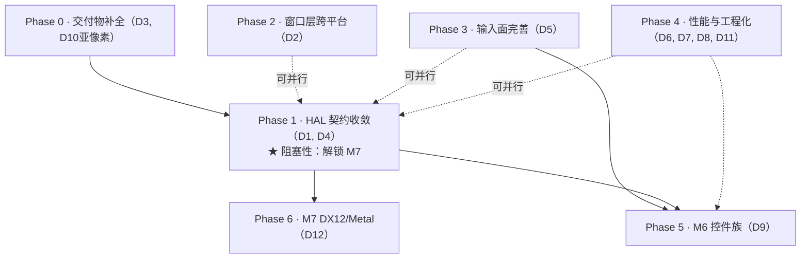

# deer-gui 后续开发计划

> **依据**：本文基于 HEAD `36e7b93`（2026-09-29）静态审阅 + [`ARCHITECTURE.md`](ARCHITECTURE.md) 的架构梳理产出。
> 功能现状以 [`FEATURES.md`](../FEATURES.md) 为准，里程碑判据以 [`ROADMAP.md`](../ROADMAP.md) 为准；本文与它们冲突时以那两份为准。
> **工作量口径**：S ≤ 1 人日；M = 1–3 人日；L = 3–10 人日（粗估，用于排序而非承诺；本环境未做性能剖析，涉及性能的项需先测量）。
> **仓库纪律提醒**（`agent.md` §1–2）：每个功能完成 = 同一提交里「示例 + 指南 + `FEATURES.md` 登记 + `TUTORIAL.md`（若属主线）」四件套；新增依赖必须先登记；不许为变绿削弱判据。

---

## 0. 短板与技术债盘点

| # | 问题 | 证据 | 影响 |
|---|---|---|---|
| D1 | **HAL 契约与实际渲染路径分叉**：`VulkanFrame::record` 对非空 `DrawList` 报 `Unsupported`，M3c 的真实 UI 呈现走 `WindowedRenderer::draw_and_present(list, engine)` 直连 | `crates/deer-vk/src/hal.rs:168-184`、`crates/deer-vk/src/windowed.rs`（`draw_and_present` 签名） | 「加后端 = 实现一个 trait」的承诺在 UI 绘制路径上未兑现；**阻塞 M7（DX12/Metal）与 HAL 层测试的语义完整性** |
| D2 | **窗口层平台锁死 Windows**：`raw_handle_from_rwh06` 只实现 Win32，其余平台 `Err` | `crates/deer-window/src/lib.rs:209-210, 993-1009` | Linux/macOS 无法开窗（尽管离屏 Vulkan 可跑）；跨平台叙事不成立 |
| D3 | **通用纹理与间接绘制缺「指南 + 示例」**：本体已落地但按仓库纪律不能算完成 | `FEATURES.md` 三节末两行 🔄、`ROADMAP.md` M3+ | 交付物缺口（纪律红线：`docs_consistency.rs` 会管 ✅ 行，🔄 是主动降档） |
| D4 | **纹理 RGB 调制缺失**：统一 FS 只读 `texture(tex, uv).r`（覆盖率语义）；窗口路径贴纹理入口只有离屏侧 | `FEATURES.md` 第四节「纹理的 RGB 采样」 | 图片/图标类控件（M6 `Icon`）无法实现 |
| D5 | **输入面剩余**：方向键导航、滚动条/惯性滚动、右/中键语义、IME 预编辑、`texts` 光标、按键重复 | `FEATURES.md` 第四节、`docs/features/input.md` §6；右/中键仅有变体（`interaction.rs` 测试证实只有左键驱动 Clicked） | M6 控件（`Switch`/`ScrubNum`/`DropMenu`）缺输入地基 |
| D6 | **每帧 `unify` 的 `Vec` 堆分配** | `ROADMAP.md` M3+「仍未做」 | 性能债（程度未测量） |
| D7 | **单窗口限制**（渲染器与测试基建） | `ROADMAP.md` M3+ 方案 (b) 未修、`hal.rs`「只支持一个交换链」 | 多窗口/dock（M5 剩余）被阻塞 |
| D8 | **线程模型未定（Q-4）**：HAL 不要求 `Send`/`Sync`，渲染线程 vs UI 线程边界未决 | `ROADMAP.md` Q-4 | 后台线程驱动 UI 只能靠 `Waker`；架构级决策悬置 |
| D9 | **控件只有 5 种**；M6 需 12+ 个 `deer-ui` 控件语义 | `FEATURES.md` 第四节、`ROADMAP.md` M6 | 产品可用性主缺口 |
| D10 | **文本域**：亚像素定位未接引擎；CFF/kern/RTL 不支持（部分是有意的） | `FEATURES.md` 第四节、`ROADMAP.md` M4-6 | 中文/复杂排版质量上限受限 |
| D11 | **示例工程 path 硬编码** `Z:/deer-gui/...` | `test_project/deer-hello/Cargo.toml:7` | 他人无法直接构建示例工程 |
| D12 | **DX12 / Metal 完全没有** | `ROADMAP.md` M7 | 后端可移植性承诺未验证 |

---

## 1. 阶段总览与依赖关系

- **串行主干**：Phase 0 → Phase 1 →（Phase 6 与 Phase 5 各自推进）。
- **可并行线**：Phase 2（改 `deer-window`）、Phase 3（改 `interaction.rs` 纯逻辑）、Phase 4 的多数项与 Phase 1 **互不触碰同一文件**，可并行推进。
- **Phase 5（控件族）** 是产品里程碑 M6，依赖 Phase 1（HAL 收敛后再加控件不返工）与 Phase 3（`Switch`/`ScrubNum` 等需要方向键/拖动/焦点完善）。

---

## 2. Phase 0 —— 交付物补全（M3+/M4 收尾）

**目标**：把两行 🔄（通用纹理、间接绘制）按仓库纪律补成 ✅；对亚像素定位做出「接入或明确不做」的决策。本阶段**不引入新能力**，只补交付物，风险最低。

| 任务 | 内容 | 验收标准 | 依赖 | 工作量 |
|---|---|---|---|---|
| T0.1 通用纹理指南+示例 | `docs/features/textures.md`（按 TEMPLATE 7 节，含「做不到什么」）+ `examples/textures.rs`（结尾自检断言）+ `FEATURES.md` 升 ✅ + `TUTORIAL.md` 判断是否属主线 | `cargo run -p deer-gui --example textures` exit=0；`cargo test --workspace` 全绿（含 `docs_consistency`）；指南无 `- [ ]` 残留 | 无 | S–M |
| T0.2 间接绘制指南+示例 | 同上模式：`docs/features/indirect-draw.md` + `examples/indirect_draw.rs`，展示 `vkCmdDrawIndexedIndirect` 离屏+窗口两路径与稳态零分配 | 同上；`RenderStats` 计数可复现 | 无 | S–M |
| T0.3 亚像素定位决策 | 二选一：① 接入 `TextEngine`（opt-in，默认整数落位不变）；② 登记不接（像 hinting 一样写实测依据）。改 `crates/deer-gpu/src/text.rs` / `null.rs` 或只写决策记录进 `ROADMAP.md` | ① 路径上有 parity 判据（不透明逐字节）+ 指南；② `ROADMAP.md` 有登记段落 | 无 | ① M / ② S |

**阻塞性**：T0.1/T0.2 阻塞 `FEATURES.md` 状态与 Phase 1 的纹理任务对齐（避免指南写两遍）。
**并行性**：T0.1、T0.2、T0.3 三者可并行。

---

## 3. Phase 1 —— HAL 契约收敛 ★ 阻塞性阶段

**目标**：让「加一个后端 = 实现 `Backend`/`Device`/`Frame`」的承诺在 **UI 绘制路径**上成立，为 M7（DX12/Metal）与 M6（控件不返工）扫清最大架构债。

| 任务 | 内容 | 验收标准 | 依赖 | 工作量 |
|---|---|---|---|---|
| T1.1 UI 录制路径接入 HAL `Frame::record` | 把 `WindowedRenderer::draw_and_present(list, engine)` 的 UI 录制逻辑挂到 `VulkanFrame::record(DrawList)` 上（`hal.rs:168-184` 消除 `Unsupported`），需要解决 `TextEngine` 如何经 HAL 传入（`Device`/`Frame` 契约可能要加一个口，属公开 API 变更 —— 按 `agent.md` §6「改公开 API 先问」执行） | `hal_window_path` 示例在真窗口下 `record(含形状+文本的 DrawList)` 成功出像素；`window_parity` 判据不变（不透明逐字节 / 半透明 ≤1 LSB）；`hal.rs` 的 `Unsupported` 分支删除 | T0.1（纹理指南先定型，避免接口返工） | L |
| T1.2 纹理契约落地 HAL | `VulkanDevice::create_texture` / `upload_texture`（`hal.rs:98-113`）接 `device.rs` 已落地的 `RGBA8_UNORM` 实现 | HAL 路径可建纹理、上传、回读四通道保真（离屏已有判据复用） | T0.1 | M |
| T1.3 纹理 RGB 调制 | 新片元着色器：统一 FS 读 `rgba` 并与颜色调制（保留覆盖率语义为特例），过 `spirv-val`；窗口路径 `draw_textured_quad` 入口 | 离屏纹理 quad 与 CPU 参考逐字节对照；`window_parity` 不回退 | T1.2 | M–L |
| T1.4 `read_pixels` 语义决策 | HAL `Frame::read_pixels` 现报 `Unsupported` 并指向 `read_back_last_frame`（`hal.rs:186-194`）。决策：① 契约改为「present 后回读」并实现；② 保持报错但把语义写死进 trait 文档 | trait 文档明确无歧义；若实现，`window_parity` 走 HAL 路径也能取像素 | T1.1 | S（决策）/ M（实现） |

**阻塞性**：**本阶段整体阻塞 M7**（DX12/Metal 必须先有完整、无分叉的 HAL 契约，否则每个后端都要重造 `draw_and_present` 直连路径）。
**并行性**：T1.1 完成前 T1.2 可先行（纹理不依赖 record 接线）；T1.3 依赖 T1.2；T1.4 依赖 T1.1。
**风险提示**：T1.1 涉及 HAL 公开契约变更（`DrawList` 之外还需 `TextEngine` 的传递），需要先在 `ROADMAP.md` 登记设计决策再动手（本仓库的「先登记后实现」纪律）。

---

## 4. Phase 2 —— 窗口层跨平台（D2）

**目标**：Linux（X11/Wayland）与 macOS 能开真窗并呈现，兑现「离屏全平台 + 窗口 Windows-only」之外的平台叙事。

| 任务 | 内容 | 验收标准 | 依赖 | 工作量 |
|---|---|---|---|---|
| T2.1 X11 句柄填法 | `raw_handle_from_rwh06` 增加 `Xlib`/`Xcb` 臂（`platform = X11`，`handle = Window`，`display = Display*`）；`deer-vk/src/surface.rs` 的 `VkXlibSurfaceCreateInfoKHR` 路径（若未实现则一并补） | Linux 上 `window_preview` 开窗、呈现 30 帧、exit=0；`DEER_VK_WINDOW_TESTS=1 window_parity` 通过 | 无（与 Phase 1 并行） | M–L |
| T2.2 Wayland 句柄 | `Wayland` 臂 + `vkCreateWaylandSurfaceKHR` | 同上（Wayland 会话） | T2.1 | M |
| T2.3 macOS（NSView） | `AppKit` 臂 + `vkCreateMetalSurface`（或先登记「Vulkan on macOS 需 MoltenVK」的限制说明） | 至少：错误信息诚实、指南登记边界；理想：MoltenVK 下开窗 | T2.1 | M–L |

**并行性**：与 Phase 1/3/4 完全并行（只动 `deer-window` + `deer-vk/src/surface.rs`）。
**验收注意**：需要对应平台的环境实测；本仓库纪律「本机实测≠跨设备结论」，每平台都要跑 `window_parity` 的像素判据，不能只看开窗。

---

## 5. Phase 3 —— 输入面完善（D5）

**目标**：补齐 M5 剩余的输入语义，为 M6 控件族打地基。改动集中在 `deer-gui/src/interaction.rs`（纯逻辑，可单测）与 `deer-window/src/lib.rs`（事件翻译）。

| 任务 | 内容 | 验收标准 | 依赖 | 工作量 |
|---|---|---|---|---|
| T3.1 方向键导航 | `Key::Left/Right/Up/Down` 已有变体（`deer-window/src/lib.rs:603-616`）但交互层不消费。在 `interaction.rs` 的 `handle` 中实现焦点在容器内的方向移动（与 `Tab` 同一地位的「焦点序」规则需先定义） | 纯逻辑单测（无窗口）；`interactive_form` 扩展场景演示；`input.md` §6 清单勾掉该项 | 无 | M |
| T3.2 滚动条与惯性滚动 | 滚轮垂直滚动已落地（`scroll-and-multiline.md`）；补：可视滚动条命中/拖动、惯性动画（用 `Waker::wake_after` 推进，**不**退化成 `Continuous`） | 滚动条拖动改变 offset；惯性衰减到停在边界内；账本可证明无空转（`iters` 观测） | 无 | M–L |
| T3.3 右/中键语义 | `PointerButton::Right/Middle` 变体已在（`interaction.rs` 测试证实不触发 Clicked）。定义右键语义（上下文菜单？仅事件透传？）并在 `handle` 中产生对应 `UiEvent` | 决策登记 `ROADMAP.md`；实现 + 单测 + 指南更新 | 无 | S–M |
| T3.4 IME 预编辑 | `deer-window` 已开 `set_ime_allowed(true)` 且 `Preedit` 用于抑制重复文本（`lib.rs:1503-1517`）。补 `InputEvent::ImePreedit` 变体 + 交互层「预编辑缓冲」状态 + Field 光标处显示 | 中文输入法预编辑可见、Commit 后上屏一次；`input.md` 更新 | T3.5（光标位置） | M–L |
| T3.5 `texts` 光标位置 | `UiState.texts` 目前只有内容（`BTreeMap<String,String>`）。加光标（字节/字符位）建模 + `Backspace` 删光标处 + 方向键移动光标 | 单测覆盖多字节字符（中文/emoji）边界；`counter`/`interactive_form` 示例更新 | 无 | M |
| T3.6 按键重复 | winit 的 `repeat` 未建模（`deer-window`「仍未接线」清单）。`KeyDown` 加 `repeat: bool` 字段（接口变更需冻结审查：既有 match 是否被破坏） | `input.md` §6 勾掉；镜像定义同步（`interaction.rs` mirror 与 `deer-window` 逐字一致纪律） | 无 | S |

**并行性**：全部与 Phase 1/2 并行；T3.4 依赖 T3.5；建议顺序 T3.5 → T3.4，T3.1/T3.2/T3.3/T3.6 任意。
**注意**：T3.6 改 `InputEvent` 公开枚举 —— 按仓库纪律「改公开 API 先停下来问」，且必须同步 `interaction.rs` 的 mirror（两处定义逐字相同的纪律）。

---

## 6. Phase 4 —— 性能与工程化（D6, D7, D8, D11）

**目标**：消掉可测的性能债、悬置的架构决策与工程毛刺。

| 任务 | 内容 | 验收标准 | 依赖 | 工作量 |
|---|---|---|---|---|
| T4.1 `unify` 零分配 | 消掉每帧 `Vec` 堆分配（`vertex_unify.rs`）：跨帧复用目标缓冲（先测量：`RenderStats` 的 alloc 计数口径已存在） | 稳态（语料不变）`allocs` 计数为 0；像素判据不变 | 无 | M |
| T4.2 线程模型决策（Q-4） | 写决策记录：渲染是否独占线程、`Device` 是否要 `Send`（现状 `Rc<RefCell>` 表明单线程假设，`hal.rs:44`）；与 `Waker`（已 `Send`）的关系 | `ROADMAP.md` Q-4 从「未决」改为「已决 + 依据」；如改契约则带迁移说明 | 无（决策） | S（决策）/ L（若改 Send） |
| T4.3 示例工程 path 修复 | `test_project/deer-hello/Cargo.toml:7` 的 `Z:/deer-gui/...` 改为可移植方案（如 `[patch]` + 环境说明，或文档写明「clone 后请改此行」——注意 `agent.md` 明令不要为跑通而随手改成自己机器的路径再提交，需与维护者确认方案） | 任一机器 clone 后按 README 一条命令可构建；方案经维护者确认 | 无 | S |
| T4.4 多窗口基建 | 渲染器支持多交换链（`hal.rs`「只支持一个交换链」）+ `deer-window` 多窗口事件路由（`WindowId` 目前弃用） | 两个窗口同时呈现，各自 parity；`ROADMAP.md` M3+ (b) 勾掉 | T1.1 | L |
| T4.5 版本与发布准备 | 版本 `0.0.0` → `0.1.0`；决定是否发 crates.io（发布 = API 冻结承诺，需先做 prelude/HAL 面审查） | `ROADMAP.md` 登记；若发布，`cargo publish --dry-run` 通过 | T1.1（API 稳定前提） | M |

**并行性**：T4.1/T4.3 完全独立可并行；T4.2 独立；T4.4 依赖 T1.1；T4.5 依赖 T1.1。

---

## 7. Phase 5 —— M6 控件族（D9）

**目标**：从 `deer-ui` 迁移 12+ 个控件**语义**（不取 DOM/CSS 实现）：`Btn`/`ChipGroup`/`Segmented`/`TabBar`/`Switch`/`NumberField`/`ScrubNum`/`ColorField`/`Dialog`/`Overlay`/`DropMenu`/`HoverTip`/`Icon`/`Row`/`RowActions`/`Keep`（`ROADMAP.md` M6 清单）。

**建议拆分顺序**（每批一个里程碑小节，各自带四件套交付）：

| 批次 | 控件 | 前置 |
|---|---|---|
| 5a 基础 | `Btn`（现有 `Button` 语义对齐 deer-ui）、`Row`/`RowActions`、`Keep` | 无 |
| 5b 布局类 | `Overlay`、`Dialog`、`HoverTip` | T3.1（方向键在对话框内移动）部分 |
| 5c 选择类 | `Segmented`、`ChipGroup`、`TabBar` | T3.1 方向键导航 |
| 5d 数值类 | `NumberField`、`ScrubNum`、`Switch`、`ColorField` | T3.1 + T3.5（光标）+ T3.6（按键重复） |
| 5e 图标 | `Icon`（需要 T1.3 纹理 RGB 调制） | Phase 1 T1.3 |
| 5f 菜单 | `DropMenu`（右键上下文菜单若做则依赖 T3.3） | T3.3 |

**验收标准（每批）**：`Kind` 扩展或组合层新增；`build_draw_list` 加分支（唯一改动点，后端零改动）；示例 + 指南 + `FEATURES.md` 四件套；testkit 能注入对应输入并断言状态。
**工作量**：每批 M–L，整阶段 L+（跨多个迭代）。
**阻塞性**：5d/5e/5f 被输入/纹理任务阻塞；5a–5c 仅依赖 Phase 3 部分项，可与 Phase 1 后半并行。

---

## 8. Phase 6 —— M7 DX12 / Metal 后端（D12）

**目标**：各实现 HAL trait，用 CPU 参考后端做像素级对照（`ROADMAP.md` M7 原文）。

| 任务 | 内容 | 验收标准 | 依赖 | 工作量 |
|---|---|---|---|---|
| T6.1 DX12 后端 | 新 crate `deer-dx`：符号加载（COM）、设备/交换链/管线/同步，实现 `Backend`/`Device`/`Swapchain`/`Frame` | 与 CPU 逐像素 parity（复用 testkit `GpuProbe`）；`FEATURES.md` 四件套 | **Phase 1 全部完成（硬阻塞）** | XL（多迭代） |
| T6.2 Metal 后端 | `deer-mt`（macOS；或登记 MoltenVK 路线后降级为可选） | 同上 | Phase 1 + T2.3 | XL |

**说明**：DX12 的手写绑定工作量与 `deer-vk` 相当（符号声明、结构体布局、命令队列模型差异更大）；Phase 1 的 HAL 收敛是它**不可绕过**的前置 —— 这也是把 Phase 1 标为阻塞性阶段的原因。

---

## 9. 阻塞性 vs 可并行汇总

### 9.1 阻塞性任务（在关键路径上）

| 任务 | 阻塞了谁 |
|---|---|
| **T1.1 HAL `record` 接线** | T1.4、T4.4、T4.5、Phase 6 全部、Phase 5 的稳定性前提 |
| **T1.2 → T1.3 纹理链** | Phase 5e（`Icon`）、图片类控件 |
| **T3.5 光标 → T3.4 IME** | Phase 5d（`NumberField` 等） |
| **T0.1 纹理指南** | T1.2/T1.3（接口定型的前置） |

### 9.2 可并行任务（互不触碰同一文件 / 无数据依赖）

| 组 | 任务 | 触碰面 |
|---|---|---|
| A | T0.2、T2.1–T2.3 | `deer-window` + `deer-vk/surface.rs` |
| B | T3.1、T3.2、T3.3、T3.6、T0.3 | `deer-gui/interaction.rs` + 指南 |
| C | T4.1、T4.2、T4.3 | `vertex_unify.rs` / 文档 / 示例工程 |

三组之间及与 Phase 1 主干均可并行；单人开发时建议按「Phase 0 → T1.1 → T1.2/T1.3 → Phase 3 → Phase 5」推进，跨平台（Phase 2）在有 Linux/macOS 设备的窗口期插入。

---

## 10. 待确认点（信息不足，不臆造）

1. **T1.1 的 API 形态**：`TextEngine` 经 HAL 传递的最佳契约（`Frame::record` 加参数？`Device` 挂文本引擎？）需要设计讨论 —— 本文只指出分叉事实与验收判据，不预设方案。
2. **T3.3 右键语义**：仓库未登记右键的产品意图（上下文菜单 or 纯透传），需维护者决策。
3. **T4.2 线程模型**：涉及 Vulkan 设备跨线程使用的约束（`Rc<RefCell>` 当前隐含单线程），决策需要驱动行为实测支撑。
4. **T4.3 path 修复方案**：`agent.md` 明令「不要为跑通随手改成自己机器的路径再提交」，正确方案（相对路径/文档说明/`[patch]`）需维护者确认。
5. **T2.3 macOS/Vulkan**：Metal 后端与 MoltenVK 路线二选一，仓库未表态。
6. **性能项（T4.1、D6）的实际收益**：本环境未做剖析，`RenderStats` 只给计数口径；动手前先测量（仓库纪律：「不许只说可忽略」）。
