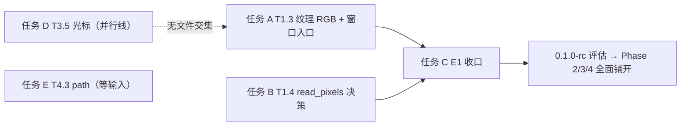

# 任务书 2026-09-30：Phase 1 收官（HAL 收敛完成线）

> **本文定位**：基于 2026-09-30 凌晨合入的 PR #1–#6（截至 `3451973`）产出的**下一步执行任务书**。
> 任务编号沿用 `docs/DEV-PLAN.md`；阶段目标与验收口径见 `docs/UPDATE-PLAN.md` §2.1/§3.4。
> 状态真相源不变：功能状态 = `FEATURES.md`，里程碑 = `ROADMAP.md`。本文**只规划，不重复登记**。

---

## 一、合并盘点：这轮 6 个 PR 带来了什么

| PR | 分支 | 核心内容 | 对应任务 | 判据（以各 PR 描述与运行输出为准） |
|---|---|---|---|---|
| #1 `d13d021` | `test/window-barrier-assertions` | 窗口侧**三类** host→缓冲屏障（顶点/索引/间接）断言 + 双向变异 | 早前会话交付 | 变异全红；四口径门禁 0 failed |
| #2 `8cb3017` | `docs/textures-guide-example` | 通用纹理补指南 `docs/features/textures.md` + `examples/textures.rs`，🔄→✅ | **T0.1 ✅** | `docs_consistency` 全绿；示例 exit=0 带自检 |
| #3 `c181820` | `docs/indirect-draw-guide-example` | 间接绘制补指南 + `examples/indirect_draw.rs`，🔄→✅ | **T0.2 ✅** | 同上 |
| #4 `670cf0f` | `docs/subpixel-decision` | 亚像素定位**决策：不接入** `TextEngine`（实测否定 + 重评触发条件登记进 `ROADMAP.md`） | **T0.3 ✅** | 决策登记 + `FEATURES.md` 口径更新 |
| #5 `fb154b0` | `feat/hal-texture-contract` | `VulkanDevice::create_texture`/`upload_texture`（**子区域**上传 + `validate_texture_region` 纯函数在碰驱动前拦越界/短源）接已落地实现 | **T1.2 ✅** | `cargo test -p deer-vk --test hal_texture`；回读四通道保真 |
| #6 `3451973` | `feat/hal-record-wiring` | **HAL `Frame::record` 接线**：签名加 `text: Option<&mut TextEngine>`（三候选方案评审后选「逐帧参数」）；`draw_and_present` 拆 `prepare_ui` + `present_prepared` ⇒ 窗口路径与 HAL 路径**共用同一段实现**；删 M2b 时代 `Unsupported(M3)` 分支 | **T1.1 ✅** | 变异 A/B/C/D 全红；`hal_window_path` 真窗出 UI 像素；`window_parity` 不回退 |

另有非任务性合入：`14b9f2a`（ARCHITECTURE / DEV-PLAN / UPDATE-PLAN 三份规划文档入库）、`a3147d7`（README 文档表加中文文档站入口；`.gitignore` 加 `.workbuddy/`）。

### 合并带来的新契约（后续任务必须遵守）

| 新契约 | 出处 |
|---|---|
| `Frame::record(&mut self, list: &DrawList, text: Option<&mut TextEngine>)`；**有文本命令但 `text = None` ⇒ `Unsupported`（绝不静默丢弃）** | PR #6，写进 `Frame::record` 文档 + `ROADMAP.md`「HAL 补课」节 |
| HAL `Device` 保持**无跨调用状态**（拒绝「挂引擎」方案①的依据） | PR #6 设计登记表 |
| `upload_texture` 的区域校验**在碰驱动前**完成（`vkCmdCopyBufferToImage` 对越界/短源不报错） | PR #5，`device.rs::validate_texture_region` |

---

## 二、基线状态（合并后）

| 项 | 状态 |
|---|---|
| Phase 0（交付物补全） | **全部完成**：T0.1 ✅ T0.2 ✅ T0.3 ✅ |
| Phase 1（HAL 契约收敛） | **T1.1 ✅ T1.2 ✅**；剩 **T1.3 / T1.4** 两项 |
| `FEATURES.md` 变化 | 通用纹理、间接绘制两行 ✅；GPU HAL 行更新为「record 真消费绘制列表（T1.1 起）」但仍 🔄（缺 `read_pixels`，见 T1.4） |
| 本工作区 | 在 `feat/hal-record-wiring`（`4234107`）；**origin/master（`3451973`）已包含它** ⇒ 分支使命完成，下一步开工前先同步到 master 基点 |
| 全量测试基线 | `cargo test --workspace -j 1`（本机纪律：单线程，防指纹文件锁）—— 结果见文末「验证记录」，以运行输出为准 |

**Phase 1 剩余缺口**（`FEATURES.md` 第四节第 77 行原文登记）：
1. **按 RGB 调制需要新的片元着色器** —— 现有统一 FS 只读 `texture(tex, uv).r`（覆盖率语义）；
2. **窗口路径贴任意纹理的入口** —— `draw_textured_quad` 同类入口目前只在离屏侧，HAL 纹理本体可用但未喂进 `WindowedRenderer` 绘制路径；
3. `read_pixels` 仍 `Unsupported`（T1.1 显式留给 T1.4 的语义决策）。

---

## 三、下一步任务（按优先级排序）

### 任务 A：T1.3 纹理 RGB 调制 + 窗口路径纹理 quad 入口 —— Phase 1 收官最大项

**为什么现在做**：Phase 1 唯一剩的大项；同时阻塞 M6 控件族的 `Icon`（UPDATE-PLAN §2.3 5e 批次）。依赖 T1.2 ✅ 已满足。

| 子任务 | 内容 | 落点 | 验收标准 |
|---|---|---|---|
| A1 调制片元着色器 | 新 FS：读 `texture(tex, uv)` 的 **rgba** 并与顶点色调制；**覆盖率语义保持为特例**（字形图集 `R8_UNORM` 路径逐字节不变）。判别符方案需设计评审：现有 `uv.x < 0 ⇒ 形状` 两态是否够用（纹理 quad 的 uv ≥ 0 与文本冲突 ⇒ 需第三态或独立管线） | `deer-vk/src/spirv.rs`（新 FS）+ `pipelines.rs` | **过官方 `spirv-val`**（纪律：驱动接受 ≠ 正确）；既有 `window_parity` / `gpu_vs_cpu` 判据**不回退** |
| A2 窗口路径纹理入口 | `WindowedRenderer` 增加 `draw_textured_quad` 同类入口（离屏侧已有先例），喂进统一顶点流 | `deer-vk/src/windowed.rs`、`vertex_unify.rs`（若加顶点态则**新顶点类型**，`UnifiedVertex` 布局冻结不动） | 与 CPU 参考逐字节对照（新语料）；`RenderStats` 计数可复现 |
| A3 CPU 参考侧 | `CpuRenderer` 支持纹理 quad 的软件采样（parity 基准的另一半） | `deer-gpu/src/null.rs` | 与 GPU 逐字节相同 |
| A4 四件套 | `docs/features/textures.md` 扩展（RGB 调制节 + 窗口入口）+ `examples/textures.rs` 扩展自检 + `FEATURES.md` 第四节第 77 行清掉 ①② | 见左 | `docs_consistency` 全绿；示例 exit=0 |

**工作量**：M–L。**风险**：判别符第三态是唯一的公开设计点 —— 若动 `UnifiedVertex`/统一管线判别符，先在 `ROADMAP.md` 登记方案再动手（同 T1.1 三步走先例）。

### 任务 B：T1.4 `read_pixels` 语义决策 —— Phase 1 清尾小项

**背景**：T1.1 显式留下（`hal.rs` 的 `Frame::read_pixels` 仍 `Unsupported`，指向 `WindowedRenderer::read_back_last_frame`）。这是 HAL 契约里最后一个「有名无实」的方法。

| 选项 | 内容 | 代价 |
|---|---|---|
| ① 契约改为「present 后回读」并实现 | `read_pixels` 语义改为「上一呈现帧的回读」，内部走 `read_back_last_frame` | M；需动 trait 文档 + `Frame` 生命周期语义（现在「提交前调用」的假设要重写） |
| ② 保持报错，trait 文档钉死 | 文档写明「交换链图像回读只在呈现后有效 ⇒ 用 `read_back_last_frame` / `OffscreenRenderer`」，且**为何不做隐式呈现**（惊吓式语义）留档 | S；零代码，纯契约澄清 |

**验收**：无论选哪个，`Frame::read_pixels` 的 trait 文档**无歧义**；若实现，`hal_window_path` 增加回读断言。**建议先选 ② 观察，E1 后有真实需求再升 ①**（避免为对称性而实现）。
**工作量**：② S / ① M。

### 任务 C：E1 收口 —— HAL 收敛完成线（Phase 1 → 里程碑）

**触发条件**：任务 A、B 完成后执行。

| 子任务 | 内容 | 验收标准 |
|---|---|---|
| C1 文档对齐 | `docs/ARCHITECTURE.md` **§3.3 已过时**（还写着「record 对非空 DrawList 报 Unsupported」—— 该分支已删）⇒ 更新为接线后的事实；§2.1 图中 `hal.rs` 节点同步 | 文档与 `hal.rs` 现状一致（引行号核对） |
| C2 计划对齐 | `docs/DEV-PLAN.md` 标记 T0.x/T1.x 完成状态；§2.1 短期路线勾掉；`UPDATE-PLAN.md` §2.1 里程碑 E1 打勾 | 三份文档进度一致，无第二真相 |
| C3 版本评估 | 按 `UPDATE-PLAN.md` §3.3：`0.1.0-rc` 评估（prelude/HAL 公开面审查 + `cargo publish --dry-run`） | 评估报告（发或不发的决策 + 理由） |
| C4 全量门禁 | 四口径：`cargo test --workspace` / `DEER_VK_WINDOW_TESTS=1`（+VALIDATION）/ `docs_consistency` / `cargo clippy --workspace` | **0 failed**（跳过项按门槛自证纪律如实报告） |

**工作量**：S–M（不含 A/B）。

### 任务 D（与 A/B/C 并行）：T3.5 `texts` 光标 —— Phase 3 关键路径起点

**为什么现在做**：不触碰 `deer-vk` / HAL 任何文件（改动集中在 `deer-gui/src/interaction.rs` + `deer-window`），与任务 A/B/C **完全并行**；且是 T3.4 IME 的硬前置（UPDATE-PLAN §2.2 M1 排期）。

| 子任务 | 内容 | 验收标准 |
|---|---|---|
| D1 光标建模 | `UiState.texts`（`BTreeMap<String, String>`）增光标位置（**字符位**，非字节位 —— `Backspace` 已按 Unicode 字符删的先例）；默认光标 = 末尾 ⇒ **既有行为逐字节不变** | 既有单测全绿；新单测覆盖多字节边界（中文 / emoji 的 `char_indices` 边界） |
| D2 光标操作 | 方向键左右移动光标（**只改光标，不发 `TextChanged`** —— dirty 语义：光标变化要不要重绘，需按 M5-4 约定定夺并登记） | 单测；`input.md` §6 勾掉「`texts` 光标位置」 |
| D3 过期注释修复 | `crates/deer-gui/src/interaction.rs:755` —— 「本里程碑没有可移动的东西（**无滚动**、无光标移动）」：滚动已落地（`Wheel` 已消费，见同文件 635 行表），理由不成立 ⇒ 更新注释为现状（方向键仍未消费，但理由改成真实的边界描述） | 注释与代码行为一致（「不许留反述」纪律） |

**工作量**：M。**注意**：D2 若给 `KeyDown` 消费方向键 ⇒ `handle` 的 match 从「不消费」变「消费」，同步检查 `r18_unconsumed_events_change_nothing` 测试是否需要拆分。

### 任务 E（可选，等维护者输入）：T4.3 示例工程 path 修复

`test_project/deer-hello/Cargo.toml` 仍硬编码 `Z:/deer-gui/...`。方案（相对 path / 文档说明 / `[patch]`）在 `UPDATE-PLAN.md` §7 待确认 —— **不阻塞，不擅自动**（`agent.md` §5.1 明令不要为跑通随手改成自己机器的路径）。

---

## 四、依赖与并行关系

| 组 | 任务 | 触碰面 | 可并行 |
|---|---|---|---|
| 主干 | A → B → C | `deer-vk`（spirv/pipelines/windowed/null）+ `FEATURES.md` | 串行（B 也可与 A 并行：B 只碰 `hal.rs` 文档/小实现） |
| 并行线 | D | `deer-gui/interaction.rs` + `deer-window` | 与主干**零文件交集** |
| 等输入 | E | `test_project/` | 不动 |

---

## 五、验证要求（全部任务统一）

1. **四口径门禁**（`UPDATE-PLAN.md` §3.4）：合并前逐项跑，报告写明跑了哪个口径 + 门槛标记 grep 了什么；
2. **像素判据红线**：不透明逐字节 0 / 半透明 ≤1 LSB —— A 的任何新语料都以此为验收；
3. **变异验证**：A2（窗口纹理入口）与 D1（光标）的新断言须双向变异变红（单侧护栏已 4 次失效的教训）；
4. **本机纪律**：`cargo test`/`build` 加 `-j 1`（指纹文件锁）；`example` 与 `cargo test` 不并发；就地还原后 `cargo clean -p <crate>`；
5. **报告三段式**：改了什么 / 验过什么（命令+环境+结果）/ 没验什么。

---

## 六、验证记录（基线）

> 基线取自**合并会话当时的实测**（master `3451973`）：四口径门禁全绿（workspace 测试 0 失败、clippy 无告警、`docs_consistency` 通过、`DEER_VK_WINDOW_TESTS=1` 真窗口集通过）。按仓库口径，具体条数以运行输出为准，本文不留档数字。后续每个任务按 §五 的口径自行验证，不依赖本节。

---

## 七、待确认点

1. **A1 判别符第三态**：若 `UnifiedVertex`/统一管线判别符要动 ⇒ 属公开设计点，按 T1.1 三步走先例（ROADMAP 登记 → 评审 → 实现）；
2. **D2 光标变化的 dirty 语义**：光标移动是否触发重绘（M5-4 约定的边界），实现前定夺；
3. **B 选 ① 还是 ②**：本文建议 ②（先观察），维护者可改；
4. **任务 E 的 path 方案**：等维护者一句话。
