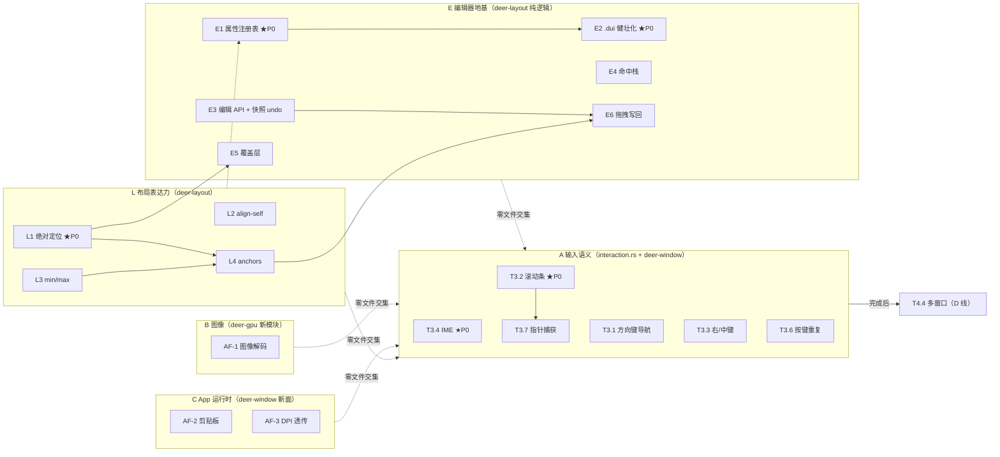

# P1 任务书 2026-10-02：完整 App 的「最后一块基础底层」

> **定位**：回答「要做出一个完整 App，还缺哪些**基础底层**」。按 `AGENTS.md` §7 四阶段工作流的 **P1 策划**格式输出（DoD-1：每条有验收标准与依赖、顺序满足依赖、公开 API 变更已列设计登记待确认）。
> **修订**：v2（2026-10-02）—— 应用户「可视化编辑器」意向，并入 **E 线（编辑器地基）**与 **L 线（布局表达力）**，A 线追加 T3.7 指针捕获。
> **修订 v3**（2026-10-02）：**分层落地** —— `docs/ARCHITECTURE.md` §2.3 登记 Godot 式 L0–L3 归属规则；`deer-gpu` 新增 `core_layer`/`text_layer`/`backend_layer` 门面模块（逻辑分层、零行为改动、零路径破坏）。本计划任务改动面映射到分层：A 线（`interaction.rs` = L2 framework）｜B 线（`deer-gpu::image` 待定属 core_layer 或 text_layer）｜C 线（deer-window 新面 = L1 DisplayServer / L3 host）｜L 线（`deer-layout` = L0 core）｜E 线（`deer-layout` + `.dui` = L0 core）。**物理拆 crate 待「Server 命名 + 时机」裁断**，本计划仍按既有 crate 推进。
> **现状基线**（master `f0dd31d`，静态审阅 + 引用各 PR 自带验证记录，未重跑测试）：Phase 0 ✅、Phase 1（HAL 收敛）✅ —— T1.1/T1.2/T1.3 ✅、GPU HAL 已转 ✅（PR #16）；T3.5 输入框光标 ✅（PR #13）；文档反述已修净（PR #19）。
> 状态真相源：`FEATURES.md`；里程碑：`ROADMAP.md`；本计划不重复登记。

---

## 一、什么叫「最后一块基础底层」

现状一句话：**能画、能点、能打字（含光标）、能上窗口（Windows）、能贴纹理** —— 一个渲染内核已经齐了。
缺的不是更多渲染能力，而是让 M6 控件族（12 个控件）、一个真实 App、以及**未来的可视化编辑器**能「站在上面盖楼」的**六类地基**：

| 地基 | 现状 | 缺什么 | 不补的后果 |
|---|---|---|---|
| **① 输入语义** | 悬停/点击/Tab 焦点/文本输入/光标/滚轮 | IME、滚动条、方向键导航、右/中键、按键重复、**指针捕获** | 中文没法打、长内容没法滚、菜单没法用、滑块类控件拖出边界就丢事件 |
| **② 图像** | 纹理管线上下行全通（T1.3 ✅） | **图像解码**（`png.rs` 只有编码器） | `Icon`/图片控件无米下锅 |
| **③ App 运行时** | App trait + 省电重绘 + Waker ✅ | **剪贴板**（ROADMAP 零登记，winit 0.30 不提供）、**DPI 透传**（现不透传） | 复制粘贴没有、高分屏模糊 |
| **④ 窗口模型** | 单窗口 | 多窗口 | 对话框/浮动面板做不了 |
| **⑤ 布局表达力** | Row/Column + pad/gap/grow/align + px/pct | **绝对定位/层叠**、per-child 对齐、min/max 尺寸、anchors | `Dialog`/`Overlay`/`HoverTip`/`DropMenu`（M6 的 4/12）做不了；分辨率无关布局无从谈起 |
| **⑥ 编辑器地基** | `.dui` 往返已有测试钉住；`Node: Clone + PartialEq` | 属性注册表、格式版本化、树编辑 API + 快照 undo、命中栈 | 编辑器「选→看→改→存」闭环无从起步 |

**边界**：本计划交付后，M6（控件族）与 Phase 2（Linux/macOS 窗口）、M7（DX12/Metal）即可开工 —— 它们**不在**本计划内。

---

## 二、有序任务清单（P1 格式：编号 · 内容 · 验收标准 · 依赖 · 优先级）

> 编号沿用 `docs/DEV-PLAN.md` 的 T 系列；新识别任务用三个新系列：**AF（App Foundation）**、**L（Layout Foundation，v2 增）**、**E（Editor Foundation，v2 增）**。
> 优先级 P0（关键路径）> P1（硬门槛）> P2（体验完整性）。

### A 线：输入语义补全（改动面：`deer-gui/src/interaction.rs` + `deer-window`）

| 编号 | 内容 | 验收标准 | 依赖 | 优先级 |
|---|---|---|---|---|
| **T3.4** | IME 预编辑：`InputEvent` 增 `ImePreedit` 变体（**mirror 两处逐字同步**——公开枚举变更，见 §三 D1）；`deer-window` 的 `Preedit` 事件从「只用于抑制重复文本」升级为透传预编辑串；`UiState` 增预编辑缓冲（**不进 `texts`**，Commit 才入）；Field 光标处显示预编辑（下划线样式） | 中文输入法预编辑可见、Commit 一次上屏（无双写）；单测覆盖 Preedit→Commit 状态机与取消路径；`input.md` §6 勾掉；四件套齐 | T3.5 ✅ | **P0** |
| **T3.2** | 滚动条 + 惯性滚动：可视滚动条（命中/拖动改 offset）+ 惯性衰减动画（`Waker::wake_after` 推进，**不**退化成 `Continuous`） | 拖动滚动条改变偏移；惯性衰减停在边界内不越界；唤醒账本证明无空转；滚轮行为不回退 | 无 | **P0** |
| **T3.1** | 方向键**上下**焦点导航（左右已被光标占用）：定义容器内焦点序规则（**设计登记**，见 §三 D2）——与 `Tab` 序同源还是按几何邻近 | 纯逻辑单测（无窗口）；`interactive_form` 扩展示例；`input.md` §6 勾掉 | 无 | P1 |
| **T3.3** | 右/中键语义：决策（上下文菜单 vs 纯事件透传，见 §四 Q1）后实现 `UiEvent` 对应变体；命中/状态机不把右键当左键 | 决策登记 `ROADMAP.md`；实现 + 单测 + 指南更新 | 无 | P2 |
| **T3.6** | 按键重复：`KeyDown` 增 `repeat: bool`（**公开枚举变更**，mirror 同步，见 §三 D3）；交互层按需消费 | `input.md` §6 勾掉；既有 match 穷尽性不破（编译期保证） | 无 | P2 |
| **T3.7** | **指针捕获**（v2 增，来自 Godot 对账）：按下即捕获语义——拖拽期间指针离开节点**仍持续接收** `PointerMoved`/`PointerUp`，直至抬起；`UiState.pressed` 已记 id，缺的是「事件路由跟随捕获者」的显式规则（设计登记见 §三 D7）。滑块/`ScrubNum`/滚动条拖动的硬前提 | 单测：按下→拖出节点→节点仍收 Move→抬起结算 Clicked 取消语义正确；未捕获路径行为逐字节不变（默认 opt-in 或语义澄清，见 D7） | T3.2（滚动条拖动是第一个消费者） | **P1** |

### B 线：图像解码（改动面：`deer-gpu` 新模块）

| 编号 | 内容 | 验收标准 | 依赖 | 优先级 |
|---|---|---|---|---|
| **AF-1** | 图像解码：**BMP 解码必做**（零依赖、格式简单、Windows 画图可产）；**PNG 解码二选一**（见 §四 Q2：零依赖自写 inflate ~数百行，或先只做 BMP 并登记 PNG 的取舍）。产出 `deer_gpu::image` 模块：文件/字节 → `RGBA8` 像素 → 直接喂 `create_texture`/`upload_texture`（已 ✅） | 解码正确性用「编码回环」判据：解码 → 用自有 `png.rs` 重编码 → 字节可复现；示例 + 指南四件套；`Icon` 控件（M6）从此有米下锅 | T1.3 ✅ | **P1** |

### C 线：App 运行时（改动面：`deer-window` + 新公共面）

| 编号 | 内容 | 验收标准 | 依赖 | 优先级 |
|---|---|---|---|---|
| **AF-2** | 剪贴板：**ROADMAP 目前零登记**（新依赖或自写须先走登记流程，见 §四 Q3）。Windows 首版：自写 Win32 `OpenClipboard`/`SetClipboardData`/`GetClipboardData`（纯文本 CF_UNICODETEXT），挂进 `deer-window` 的 `App` 面（如 `Clipboard` 句柄经 `init` 交出） | 复制/粘贴往返保真（含中文/emoji 多字节）；非 Windows 明确 `Unsupported` 不静默；跨进程与记事本互贴实测；四件套 | 无 | **P1** |
| **AF-3** | DPI/缩放透传：`WindowInfo` 增 `scale_factor`；`InputEvent` 增 `ScaleFactorChanged`（**公开枚举变更**，见 §三 D3 同批处理）；现状「物理像素直传、缩放换算留给上层」的边界**保持**——只透传不换算，避免破坏像素判据 | 高分屏（如 150%）下事件坐标与 `WindowInfo` 口径一致可解释；`window.md` 更新「不透传 DPI」的旧反述；像素判据不受影响（换算仍在上层） | 无 | P2 |

### D 线：窗口模型（改动面：`deer-vk` + `deer-window`）

| 编号 | 内容 | 验收标准 | 依赖 | 优先级 |
|---|---|---|---|---|
| **T4.4** | 多窗口：渲染器多交换链（`hal.rs` 现「只支持一个交换链」、`Rc<RefCell<Option<WindowedRenderer>>>` 改按窗口索引的表）；`deer-window` 事件路由带 `WindowId`（现弃用） | 两个窗口各自 `window_parity` 通过；`ROADMAP.md` M3+(b) 测试基建限制勾掉 | **A 线完成后**（避免 interaction 同期大改） | P1 |

### L 线：布局表达力（v2 增；改动面：`deer-layout` + 渲染器 + `.dui` 语法，公开契约见 §三 D6）

> 全部走 **opt-in 模式**（沿用 `scroll`/`wrap` 的先例）：默认关闭 ⇒ 既有树逐字节不变，像素判据不破。
> 出处：布局系统分析（2026-10-02）——`measure_into`/`place` 已核对（`layout.rs:171-611`）。

| 编号 | 内容 | 验收标准 | 依赖 | 优先级 |
|---|---|---|---|---|
| **L1** | **绝对定位/层叠**：`LayoutProps` 增 `position: Option<Pos>`（相对最近容器的锚定/绝对，脱离 Row/Column 流）；渲染按「声明序即层序」后画；命中测试同步覆盖层叠序 | M6 的 `Dialog`/`Overlay`/`HoverTip`/`DropMenu` 四个控件的地基；既有流内树逐字节不变（opt-in）；命中先层叠后流内 | 无 | **P0**（M6 硬阻塞） |
| **L2** | **per-child 交叉轴对齐**（等价 flexbox `align-self`）：`LayoutProps` 增 `cross_self: Option<Align>`，覆盖容器级 `cross_axis` | 单测：容器 `cross=start` 但单个子节点 `cross_self=center` 各自正确；不设 ⇒ 逐字节不变 | 无 | P1（成本极低） |
| **L3** | **min/max 尺寸**：`LayoutProps` 增 `min_w/max_w/min_h/max_h: Option<Size>`。注意 min **同时**进测量阶段（影响固有尺寸）与排布阶段（分配下限），需配不变式测试 | 单测：grow 与 min/max 共存时的分配语义有测试钉住；`.dui` 语法同步 | 无 | P1（`NumberField`/`ScrubNum` 需要） |
| **L4** | **anchors 锚定**（Godot 对账的招牌差距）：四边锚定父容器 + 像素偏移，分辨率无关布局的基础。**与 L1 的关系需先决策**（见 §四 Q5） | 单测：窗口 resize 时锚定边跟随、偏移保持；`.dui` 语法同步；编辑器锚点 UI 的运行时地基 | L1、L3 | P1（编辑器与自适应 App 双需求） |

### E 线：编辑器地基（v2 增；改动面：`deer-layout` 纯逻辑 + `.dui`，零 GPU）

> 编辑器最小闭环「**选 → 看 → 改 → 存**」的库层地基；编辑器**本体 UI 不在此计划**（见 §七）。
> 无论编辑器何时启动，这些都不浪费——它们同时是 M6 与 App 的通用能力。

| 编号 | 内容 | 验收标准 | 依赖 | 优先级 |
|---|---|---|---|---|
| **E1** | **属性注册表**：按 `Kind` 枚举可编辑属性（名/类型/取值域/默认值）的**纯数据表**（契合「树不含回调」哲学，不需要 Rust 反射）。Inspector / undo 粒度 / `.dui` 2.0 / 拖拽写回的**共同上游** | 每个 `Kind` 的全部 `LayoutProps`+`NodeProps` 字段都被枚举（防漂移测试：注册表与结构体字段一一对应，编译期或测试期钉住）；L 线新字段加进注册表是 L 线验收的一部分 | 无 | **P0**（编辑器关键路径第一项） |
| **E2** | **`.dui` 健壮化**：格式版本头 + 未知属性容错策略（现在**硬报错**，`scene.rs:248-256`，前向兼容阻碍）+ 载入时 id 查重 + 注释处理决策（现保存即丢，`preprocess` 滤掉） | 带版本头的文件旧版加载器给出明确「版本不支持」而非乱错；未知属性按登记策略处理；`t10_scene_roundtrip` 不回退；往返往返（round-trip²）稳定 | E1（属性表定语法面） | **P0**（编辑器产生用户文件**之前**锁格式是最便宜的时刻） |
| **E3** | **树编辑 API + 快照 undo**：增/删/移动/reparent/改单属性 的编辑操作面 + 基于 `Node: Clone + PartialEq` 的**快照式撤销栈**（整树存档——对小树天然正确，刻意**不**做命令式反转） | 每个操作有单测（含 reparent 的容器约束：叶子不可挂子）；undo/redo 往返后 `structurally_eq` 原树；快照上限策略登记 | 无 | P1 |
| **E4** | **命中栈**：`hit_test` 扩展出**有序命中栈**变体（不只最深者）+ 框选矩形相交查询。编辑器 alt-click 选透与 marquee 的唯一依据 | 单测：嵌套容器 + 层叠（L1）下的栈序正确；既有 `hit_test` 行为逐字节不变（新增并行 API，不改旧签名） | 无（层叠序正确性依赖 L1） | P1 |
| **E5** | **编辑器覆盖层**：在实时预览**之上**画选中框/手柄，不污染应用命中与语义；状态预览（hover/pressed 态）可合成 `UiState` 喂 `build_interactive_draw_list`（这半边今天就能做） | 覆盖层绘制零命中影响（判据：注入点击不落在 gizmo 上）；`FEATURES.md` 登记边界 | L1 | P2 |
| **E6** | **拖拽写回**：拖手柄改尺寸/拖动移节点 → 写回 `LayoutProps` 的映射规则（px 还是 pct？锚定下拖动改 offset 还是 anchor？） | 映射规则登记 `ROADMAP.md`；操作经 E3 的 undo 栈可撤销 | L1、L3、L4、E3 | P2 |

---

## 三、公开 API 变更与设计登记清单（**等人确认后才动**，按 §7.1 第 4 条）

| # | 变更 | 涉及 | 登记要点 |
|---|---|---|---|
| D1 | `InputEvent` 增 `ImePreedit { text: String }`（T3.4） | `deer-window` + `interaction.rs` mirror **两处逐字同步** | 变体命名/字段；预编辑缓冲归属（UiState 新字段 vs 事件态）；与既有「Preedit 抑制重复文本」逻辑的合并方式 |
| D2 | 容器内方向键焦点序规则（T3.1） | `interaction.rs` 纯逻辑 | 规则选型：Tab 序复用 vs 几何邻近（推荐几何邻近——Tab 是构建序、方向键是空间语义，两者本就不同） |
| D3 | `KeyDown` 增 `repeat: bool` + `InputEvent` 增 `ScaleFactorChanged`（T3.6/AF-3） | 同 D1 两处 | **建议合并成一次 mirror 变更**（一次冻结审查、一次同步，避免三次破性改动） |
| D4 | 剪贴板公共面（AF-2） | `deer-window` 新面 | 句柄式（`init` 交出 `Clipboard`，与 `Waker` 同型）vs App 方法式；非 Windows 行为 |
| D5 | 多窗口（T4.4） | `deer-vk`/`deer-window` | `WindowId` 复活；HAL `Device` 是否允许多 swapchain（trait 语义本来允许，实现层解锁） |
| D6 | **`LayoutProps` 扩展**（L1–L4：`position`/`cross_self`/`min_w/max_w/min_h/max_h`/anchors） | `node.rs` + `scene.rs` + `builder.rs` 的 `L` | `LayoutProps` 是**三契约的公共部分**：数据模型、`.dui` 语法、两路结构相等断言——加任何字段 = 同步改三处 + `.dui` 语法测试。建议 L1–L4 **一批设计登记、按 L1→L2→L3→L4 顺序分 PR 实现**（T1.1 三步走先例） |
| D7 | **指针捕获语义**（T3.7） | `interaction.rs` 纯逻辑 | 按下即捕获是否默认（倾向：**默认捕获**是行业惯例语义，但会改既有「拖出即丢」行为 ⇒ 须先实测现状、登记差异再定）；捕获期间 `PointerMoved` 路由到捕获者还是广播 |

---

## 四、疑问与判断（带着判断继续，不静默）

| # | 疑问 | 我的判断（可推翻） |
|---|---|---|
| Q1 | 右键语义是「上下文菜单」还是「纯透传」？（T3.3） | **先纯透传**（`UiEvent::PointerRight` 级别），菜单属 M6 控件；地基只保证事件能到上层 |
| Q2 | PNG 解码自写还是登记第三方（如 `png` crate）？（AF-1） | **先只做 BMP** 零依赖落地，PNG 解码单独立项按需决策——`Icon` 场景 BMP 够用，自写 inflate 的收益要等真实需求 |
| Q3 | 剪贴板自写 Win32 还是引 `arboard`？（AF-2） | **自写**（CF_UNICODETEXT 约 60 行）——引 `arboard` 要走依赖例外登记且带入整棵传递依赖树，与「除 winit 外零依赖」的口径冲突成本高 |
| Q4 | AF-3 DPI 换算要不要下沉进布局（自动按 scale 放大）？ | **不下沉**——布局是像素级确定性纯函数（I-1/I-2），自动缩放会破坏逐字节判据；只透传 `scale_factor`，换算留给上层显式做 |
| Q5 | L4 anchors 与 L1 position 是**一个机制还是两个**？（v2 增） | 倾向**一个**：anchors 即 position 的参数化形态（`Pos::Anchors{..}` 一个变体覆盖「绝对偏移」），Godot 也是单一锚点体系承载两种用法；两个机制必然在编辑器 UI 里打架。**待 L1 设计时定** |
| Q6 | E2 未知属性容错是「保留原样」还是「警告+丢弃」？（v2 增） | 倾向**警告 + 结构化保留**（编辑器往返不能默默吃掉用户文件里的未来字段）——但这与「写错了但不生效最难查」的既有报错哲学（`scene.rs:147-162` 开关属性带值即报错的理由）有张力，须维护者裁断 |
| Q7 | E3 快照 undo 的栈上限与内存策略？（v2 增） | 倾向**固定条数上限**（如 100 步）+ 顶层登记；小树快照便宜，不引入命令模式的复杂度——复杂度收益不成比例（编辑器分析结论） |

---

## 五、依赖顺序与并行分组（按文件面切，互不触碰即可并行）

- **关键路径（App 线）**：T3.4 → T3.2 → T3.7 → T3.1 →（A 线收口）→ T4.4；
- **关键路径（编辑器线，v2 增）**：E1 → E2 → E3/E4（并行）→（L1 → L4）→ E5 → E6；
- **完全并行**：A/B/C/L/E 五线改动面互不重叠（`interaction.rs`+`deer-window` / `deer-gpu::image` / `deer-window` 新面 / `deer-layout` 布局 / `deer-layout` 编辑 API），可五线并行；唯一交叉：**L 线每加一个 `LayoutProps` 字段须同步 E1 属性注册表**（防漂移测试把它变成红/绿）；
- **注意**：A 线内部 T3.4/T3.6/AF-3 都要动 `InputEvent` **mirror**，建议 D1+D3 合并成**一次**设计登记 + 一次实现批次（mirror 两处逐字同步的纪律，改动次数越少越安全）；T3.2 只碰交互层纯逻辑，可随时插入；**L 线的 D6 也建议一批登记、分 PR 实现**。

---

## 六、执行方式（对齐 AGENTS.md §7）

1. **P1（本文件）**：请人确认 §三 设计登记（尤其 D1+D3 合并方案、D6 一批登记、D7 默认捕获与否）与 §四 判断项；
2. **P2**：一功能一分支一 PR，攒着不合（分支名沿用 `feat/<名字>`）；每条按 DoD-2 自测（四件套 + 最小口径门禁 + 双向变异）；
3. **P3**：全部 PR 齐后集中评审，产出合并顺序清单（依赖序：先并行线后关键路径尾部）；
4. **P4**：按序合并，master 始终绿；
5. **收口**：A–E 五线全合后，`DEV-PLAN.md`/`UPDATE-PLAN.md` 状态对齐 + `FEATURES.md` 第四节清掉对应「明确不行」条目 —— 届时：
   - **M6 控件族解锁**（L1/L2/L3 + 输入地基）；
   - **可视化编辑器最小闭环解锁**（E1–E6：选 → 看 → 改 → 存），编辑器本体可按「用 deer-gui 搭 deer-gui 编辑器」启动；
   - 「完整 App」只剩盖楼。

---

## 七、本计划不做什么（边界）

- 不做 M6 的 12 个控件（`Icon` 之外的地基已含在此）；
- 不做 Linux/macOS 窗口（Phase 2，`deer-window` 平台臂）；
- 不做 DX12/Metal（M7）；
- 不做 dock 停靠面板（依赖多窗口 T4.4 落地后属 M6 范畴）；
- **不做编辑器本体 UI**（v2 增：树视图/Inspector 面板等编辑器界面属编辑器项目，依赖 M6 控件；本计划只交付**库层**地基）；
- 不做九宫格 StyleBox / 富文本多 span / 主题层级 / DnD（Godot 对账的 🟡 级差距，待 E2 版本化 + M6 之后另立计划）；
- 不做增量布局（与「纯函数+重建树」架构叙事冲突，性能项先测量后动手——大树基准属 P2 观察项，不在本计划任务内）；
- 不改像素判据（不透明逐字节 0 / 半透明 ≤1 LSB 是所有条目的不回退前提）。

---

## 八、执行中发现的前置缺口（2026-10-02 追加，**不是**原计划的一部分）

> 执行 T3.4 的「渲染那半」时发现：**验收里「预编辑可见」的前提不成立**。

| 缺口 | 现状（实测） | 影响 |
|---|---|---|
| **光标本身从未被绘制** | T3.5 只建模了**光标位置**（`UiState::carets` + 交互层按字符位插入/删除），**画面上没有那根竖线**：全仓 `crates/deer-gpu/` 与 `examples/` 里搜不到任何 caret 绘制代码（命中的 `caretSlope*` 是字体表字段，无关） | **T3.4 验收「预编辑可见」写不出判据** —— 预编辑要画在**光标处**、并带下划线；光标本身不显示的话，「可见」这件事无从谈起 |

**因此建议补一条任务**（编号待定，建议 **T3.8 光标渲染**）：
在聚焦的 `Field` 内、光标处画一根竖线（用 `measure` 量出光标前缀的宽度 ⇒ x 偏移），
判据可以是「插入符号位置随字符串变化而移动」+「失焦时不画」。

**T3.4 的其余部分已完成**（PR #30）：mirror 两处逐字同步、`UiState::preedit` 缓冲、
「无双写」规则（预编辑只进缓冲、提交进 `texts` 并清缓冲）、3 条纯逻辑判据。
**未做**：预编辑渲染、四件套 —— **被 T3.8 挡住**（先画得出光标，才谈得上「预编辑可见」）。

> **后记（同日）**：**T3.8 已落地**（`feat/caret-render`），T3.4 的「预编辑可见」四件套随之收口 ——
> 指南 [`ime.md`](../../features/ime.md) + 示例 `ime_preedit` 已补齐（`FEATURES.md` 转 ✅）。
> 同类地，**T3.2 的上半（可视滚动条几何 + 拖滑块改偏移）也已落地**（指南 `scrollbar.md` + 示例 `scroll_bar`）；
> **下半未做**：**点轨道跳转**、**惯性的窗口层接线**（`ScrollInertia` 是纯逻辑，`deer-window` 里没人按时调
> `inertia_step` ⇒ 真窗口看不到惯性）—— 这条要**新开一条 T3.2b 任务**补进 A 线，不能当成「T3.2 已完成」。
> 本计划正文的任务表仍按「起草时的状态」写，未逐行回改 —— **真相以 `FEATURES.md` 与各自指南为准**。
